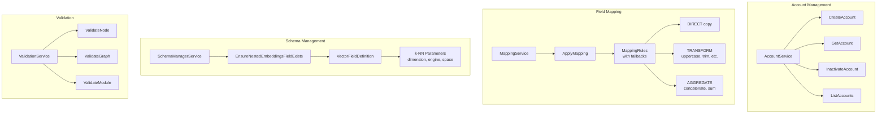

# Admin

> Part of the [AI Pipestream](https://github.com/ai-pipestream) platform - Open-source document processing for intelligent search

## Overview

The **admin** module provides administrative services for platform management, including multi-tenant account management, field mapping transformations, schema management for OpenSearch indices, and validation services for pipeline components.

This module centralizes the administrative control plane, enabling operators to manage accounts, configure field transformations, ensure proper index schemas, and validate configurations before deployment.

## Published Location

**Repository**: [`buf.build/pipestreamai/admin`](https://buf.build/pipestreamai/admin)

## Contents

| Proto File | Purpose |
|------------|---------|
| `ai/pipestream/repository/account/v1/account_service.proto` | Multi-tenant account lifecycle management |
| `ai/pipestream/repository/account/v1/account_events.proto` | Account change events |
| `ai/pipestream/mapping/v1/mapping_service.proto` | Declarative field mapping and transformation |
| `ai/pipestream/schemamanager/v1/schema_manager.proto` | OpenSearch index schema management |
| `ai/pipestream/validation/v1/validation_service.proto` | Node, graph, and module validation |

## Architecture



## Dependencies

- `buf.build/grpc/grpc` - gRPC core types
- `buf.build/googleapis/googleapis` - Google common types
- `buf.build/pipestreamai/common` - Core `PipeDoc` and `ProcessingMapping` types

## Usage

### With Buf CLI

```yaml
# Add to your buf.yaml
deps:
  - buf.build/pipestreamai/admin
```

### Code Generation

```bash
buf generate buf.build/pipestreamai/admin
```

### With Gradle (Java/Kotlin)

```kotlin
dependencies {
    implementation("build.buf.gen:pipestreamai_admin_grpc_java:+")
    implementation("build.buf.gen:pipestreamai_admin_protobuf_java:+")
}
```

## Key Messages

| Message/Service | Description |
|-----------------|-------------|
| `AccountService` | CRUD operations for multi-tenant accounts |
| `Account` | Account entity with ID, name, status, timestamps |
| `MappingService` | Apply field transformation rules to documents |
| `MappingRule` | Rule with fallback candidate mappings |
| `SchemaManagerService` | Ensure OpenSearch index schemas are properly configured |
| `VectorFieldDefinition` | k-NN vector field configuration (dimension, engine, space type) |
| `ValidationService` | Validate nodes, graphs, and modules |
| `ValidationError` / `ValidationWarning` | Structured validation feedback |

## Validation Modes

The validation service supports three modes for different development stages:

| Mode | Use Case |
|------|----------|
| `DRAFT` | Minimal validation for rapid iteration |
| `DESIGN` | Comprehensive validation during development |
| `PRODUCTION` | Strictest validation before deployment |

## Related Modules

- [`common`](../common/) - Core types including `ProcessingMapping`
- [`repo`](../repo/) - Repository service that uses account management
- [`config`](../config/) - Platform configuration service

## Documentation

- [Buf Schema Registry](https://buf.build/pipestreamai/admin)
- [AI Pipestream Documentation](https://github.com/ai-pipestream)

## License

MIT License - See [LICENSE](./LICENSE) file for details.
