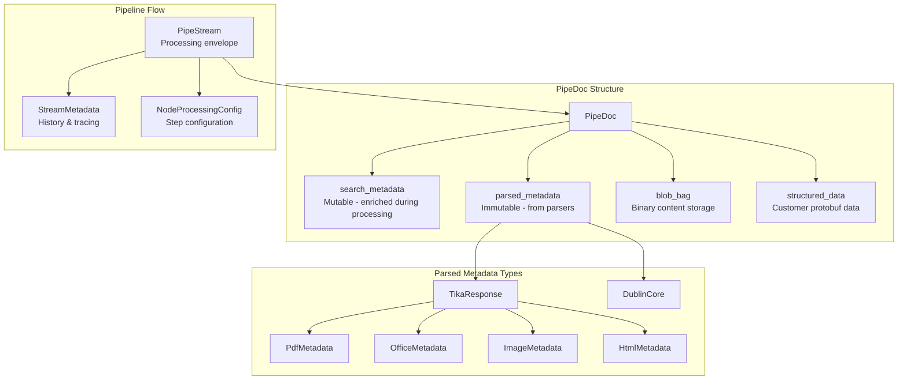

# Common

> Part of the [AI Pipestream](https://github.com/ai-pipestream) platform - Open-source document processing for intelligent search

## Overview

The **common** module is the foundation of the AI Pipestream platform, providing the core data types that flow through the entire document processing pipeline. It defines the `PipeDoc` message—the central document container—along with event definitions and comprehensive parsed metadata structures for various document formats.

This module emphasizes the critical separation between immutable `parsed_metadata` (output from parsers) and mutable `search_metadata` (enriched during pipeline processing). All other platform modules depend on these foundational types.

## Published Location

**Repository**: [`buf.build/pipestreamai/common`](https://buf.build/pipestreamai/common)

## Contents

| Proto File | Purpose |
|------------|---------|
| `ai/pipestream/data/v1/pipeline_core_types.proto` | Core `PipeDoc`, `PipeStream`, `SearchMetadata`, `Blob`, and field mapping types |
| `ai/pipestream/events/v1/document_events.proto` | Document lifecycle events (`DocumentUploadedEvent`) |
| `ai/pipestream/events/v1/repo_metadata_events.proto` | Repository metadata change events |
| `ai/pipestream/parsed/data/tika/v1/tika_response.proto` | Apache Tika parser output structure |
| `ai/pipestream/parsed/data/**/*.proto` | Format-specific metadata (PDF, Office, HTML, Image, Email, EPUB, etc.) |

## Architecture



## Dependencies

This module has no Pipestream dependencies (foundation module):
- `buf.build/grpc/grpc` - gRPC core types
- `buf.build/googleapis/googleapis` - Google common types (timestamps, Any, Struct)

## Usage

### With Buf CLI

```yaml
# Add to your buf.yaml
deps:
  - buf.build/pipestreamai/common
```

### Code Generation

```bash
buf generate buf.build/pipestreamai/common
```

### With Gradle (Java/Kotlin)

```kotlin
dependencies {
    implementation("build.buf.gen:pipestreamai_common_protobuf_java:+")
}
```

## Key Messages

| Message | Description |
|---------|-------------|
| `PipeDoc` | Central document container with search/parsed metadata separation |
| `PipeStream` | TCP-like packet header for node-to-node processing with history tracking |
| `SearchMetadata` | Standardized search fields: title, body, keywords, semantic chunks, doc outline |
| `ParsedMetadata` | Wrapper for immutable parser output (Tika, Docling) |
| `Blob` | Binary content with inline data or S3 storage reference |
| `SemanticProcessingResult` | Vector embeddings and chunked text for semantic search |
| `TikaResponse` | Comprehensive Tika parser output with format-specific metadata |

## Related Modules

All platform modules depend on common:
- [`pipeline-module`](../pipeline-module/) - Module service interface using `PipeDoc`
- [`repo`](../repo/) - Document storage and retrieval
- [`engine`](../engine/) - Pipeline orchestration with `PipeStream`
- [`parser`](../parser/) - Document parsing definitions

## Related Repositories

- [`pipestream-repository`](https://github.com/ai-pipestream/pipestream-repository) - Repository service implementation
- [`pipestream-engine`](https://github.com/ai-pipestream/pipestream-engine) - Engine implementation

## Documentation

- [Buf Schema Registry](https://buf.build/pipestreamai/common)
- [AI Pipestream Documentation](https://github.com/ai-pipestream)

## License

MIT License - See [LICENSE](./LICENSE) file for details.
