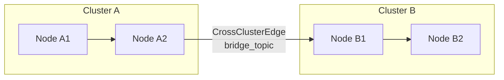

# Config

> Part of the [AI Pipestream](https://github.com/ai-pipestream) platform - Open-source document processing for intelligent search

## Overview

The **config** module defines the platform configuration service for managing clusters, pipeline graphs, module registries, and pipeline instances. It provides a gRPC-based configuration plane that replaces traditional Consul-based configuration with real-time streaming updates.

This module is the control plane for pipeline topology—defining how documents flow through processing nodes using a graph-first approach with DNS-style node addressing.

## Published Location

**Repository**: [`buf.build/pipestreamai/config`](https://buf.build/pipestreamai/config)

## Contents

| Proto File | Purpose |
|------------|---------|
| `ai/pipestream/config/v1/pipeline_config_service.proto` | Configuration service RPCs with streaming watchers |
| `ai/pipestream/config/v1/pipeline_config_models.proto` | Graph, node, edge, cluster, and module data models |

## Architecture

```mermaid
graph TD
    subgraph "Cluster Layer"
        CLUSTER[Cluster]
        CLUSTER --> TOPICS[allowed_kafka_topics]
        CLUSTER --> GRPC[allowed_grpc_services]
    end

    subgraph "Graph Layer"
        GRAPH[PipelineGraph]
        GRAPH --> NODES[node_ids]
        GRAPH --> EDGES[GraphEdge]
        GRAPH --> MODE[GraphMode<br/>DESIGN | PRODUCTION]
    end

    subgraph "Node Layer"
        NODE[GraphNode]
        NODE --> NID[node_id<br/>cluster.node-name]
        NODE --> TYPE[NodeType<br/>CONNECTOR | PROCESSOR | SINK]
        NODE --> MOD[module_id]
    end


    subgraph "Real-time Streaming"
        WATCH[Watch RPCs]
        WATCH --> WC[WatchClusterConfig]
        WATCH --> WG[WatchPipelineGraph]
        WATCH --> WM[WatchModuleRegistry]
    end
```

## Dependencies

- `buf.build/grpc/grpc` - gRPC core types
- `buf.build/googleapis/googleapis` - Google common types
- `buf.build/pipestreamai/common` - Core data types

## Usage

### With Buf CLI

```yaml
# Add to your buf.yaml
deps:
  - buf.build/pipestreamai/config
```

### Code Generation

```bash
buf generate buf.build/pipestreamai/config
```

### With Gradle (Java/Kotlin)

```kotlin
dependencies {
    implementation("build.buf.gen:pipestreamai_config_grpc_java:+")
    implementation("build.buf.gen:pipestreamai_config_protobuf_java:+")
}
```

## Key Messages

| Message/Service | Description |
|-----------------|-------------|
| `PipelineConfigService` | Full configuration service with CRUD and streaming watch RPCs |
| `Cluster` | Logical grouping with Kafka/gRPC access control |
| `PipelineGraph` | DAG of processing nodes with edges defining data flow |
| `GraphNode` | Individual processing step with DNS-style ID (`cluster.node-name`) |
| `GraphEdge` | Connection between nodes, supports cross-cluster routing |
| `ModuleDefinition` | Reusable processing module with config schema |
| `PipelineInstance` | Running instance with runtime status and config overrides |

## Node Types & Modes

| Node Type | Purpose |
|-----------|---------|
| `CONNECTOR` | Entry point receiving data from external sources |
| `PROCESSOR` | Processing node that transforms data |
| `SINK` | Exit point outputting to external systems |

| Mode | Purpose |
|------|---------|
| `DESIGN` | Frontend simulation and testing |
| `PRODUCTION` | Deployed and running pipeline |

## Cross-Cluster Routing



## Related Modules

- [`common`](../common/) - Core types used in configuration
- [`design`](../design/) - Design mode pipeline simulation
- [`engine`](../engine/) - Engine that consumes configuration
- [`repo`](../repo/) - Repository using config for settings

## Related Repositories

- [`pipestream-config`](https://github.com/ai-pipestream/pipestream-config) - Configuration service implementation

## Documentation

- [Buf Schema Registry](https://buf.build/pipestreamai/config)
- [AI Pipestream Documentation](https://github.com/ai-pipestream)

## License

MIT License - See [LICENSE](./LICENSE) file for details.
