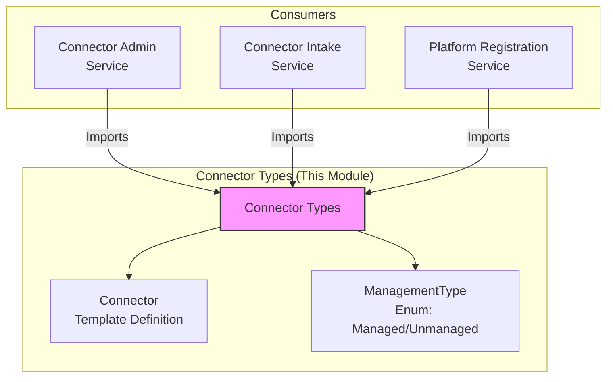

# Connector Types

> Part of the [AI Pipestream](https://github.com/ai-pipestream) platform - Open-source document processing for intelligent search

## Overview

The **connector-types** module provides the shared domain models for the Connector subsystem. It defines the fundamental `Connector` type (the template/definition of a connector) and its associated enums.

This module is extracted to allow lightweight dependencies for services that need to know *about* Connectors (like the Registration Service or Admin UI) without needing to depend on the heavy runtime service definitions found in the `intake` module.

## Published Location

**Repository**: [`buf.build/pipestreamai/connector-types`](https://buf.build/pipestreamai/connector-types)

## Contents

| Proto File | Purpose |
|------------|---------|
| `ai/pipestream/connector/v1/connector_types.proto` | Core `Connector` definition, `ManagementType` enum, and shared configuration structures. |

## Architecture



## Dependencies

- `buf.build/googleapis/googleapis` - Google common types (Struct, Timestamp)

## Usage

### With Buf CLI

```yaml
# Add to your buf.yaml
deps:
  - buf.build/pipestreamai/connector-types
```

### Code Generation

```bash
buf generate buf.build/pipestreamai/connector-types
```

### With Gradle (Java/Kotlin)

```kotlin
dependencies {
    implementation("build.buf.gen:pipestreamai_connector_types_protobuf_java:+")
}
```

## Key Messages

| Message | Description |
|---------|-------------|
| `Connector` | The template definition for a connector type (e.g., "S3", "Web Crawler"). Defines defaults and metadata. |
| `ManagementType` | Enum distinguishing between `MANAGED` (Platform controls lifecycle) and `UNMANAGED` (Push-based/External) connectors. |

## Why this module exists?

Historically, connector definitions were coupled with the Intake Service. This caused "bleeding" where administrative tools or registration services had to import the entire Intake Service definition just to understand what a "Connector" was. This module breaks that dependency chain, allowing for a clean, schema-first architecture.

## Related Modules

- [`intake`](../intake/) - The runtime service that uses these types.
- [`registration`](../registration/) - The platform registration service that discovers connectors.

## Documentation

- [Buf Schema Registry](https://buf.build/pipestreamai/connector-types)
- [AI Pipestream Documentation](https://github.com/ai-pipestream)

## License

MIT License - See [LICENSE](./LICENSE) file for details.
