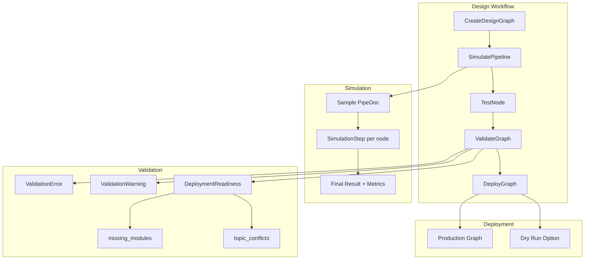
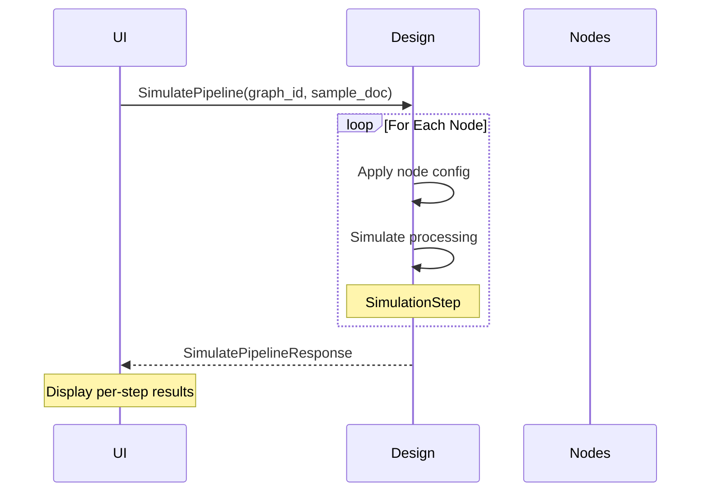
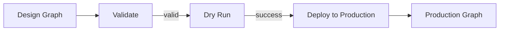

# Design

> Part of the [AI Pipestream](https://github.com/ai-pipestream) platform - Open-source document processing for intelligent search

## Overview

The **design** module provides the backend service for pipeline design and simulation in the frontend UI. It enables visual graph editing, pipeline simulation without production deployment, node testing with sample data, and deployment validation.

This module powers the design-time experience—allowing developers to build, test, and validate pipelines before deploying them to production.

## Published Location

**Repository**: [`buf.build/pipestreamai/design`](https://buf.build/pipestreamai/design)

## Contents

| Proto File | Purpose |
|------------|---------|
| `ai/pipestream/design/v1/design_mode_service.proto` | Design mode operations: create, simulate, test, validate, deploy |

## Architecture



## Dependencies

- `buf.build/grpc/grpc` - gRPC core types
- `buf.build/googleapis/googleapis` - Google common types
- `buf.build/pipestreamai/common` - Core `PipeDoc` types
- `buf.build/pipestreamai/config` - Pipeline graph configuration

## Usage

### With Buf CLI

```yaml
# Add to your buf.yaml
deps:
  - buf.build/pipestreamai/design
```

### Code Generation

```bash
buf generate buf.build/pipestreamai/design
```

### With Gradle (Java/Kotlin)

```kotlin
dependencies {
    implementation("build.buf.gen:pipestreamai_design_grpc_java:+")
    implementation("build.buf.gen:pipestreamai_design_protobuf_java:+")
}
```

## Key Messages

| Message/Service | Description |
|-----------------|-------------|
| `DesignModeService` | Design mode operations for pipeline simulation and deployment |
| `CreateDesignGraphRequest/Response` | Create a new design-time graph |
| `SimulatePipelineRequest/Response` | Run sample document through graph in frontend |
| `SimulationStep` | Per-node input/output and timing during simulation |
| `TestNodeRequest/Response` | Test individual node with sample data |
| `ValidateGraphRequest/Response` | Validate graph before deployment |
| `DeployGraphRequest/Response` | Deploy design graph to production |
| `DeploymentReadiness` | Missing modules, topic conflicts, required permissions |

## Simulation Flow



## Validation Checks

| Check | Description |
|-------|-------------|
| Graph connectivity | No orphaned nodes |
| Module availability | All referenced modules registered |
| Kafka topic naming | No naming conflicts |
| Circular dependencies | DAG validation |
| Configuration validity | JSON schema validation |

## Deployment Process



## Related Modules

- [`common`](../common/) - Core `PipeDoc` used in simulation
- [`config`](../config/) - `PipelineGraph` definition
- [`engine`](../engine/) - Production execution after deployment

## Related Repositories

- [`pipestream-ui`](https://github.com/ai-pipestream/pipestream-ui) - Frontend UI using design service

## Documentation

- [Buf Schema Registry](https://buf.build/pipestreamai/design)
- [AI Pipestream Documentation](https://github.com/ai-pipestream)

## License

MIT License - See [LICENSE](./LICENSE) file for details.
