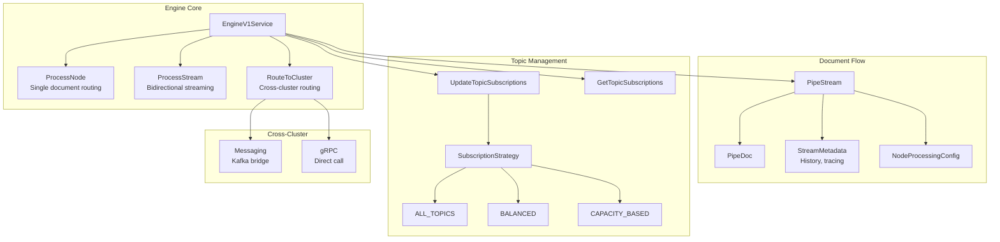
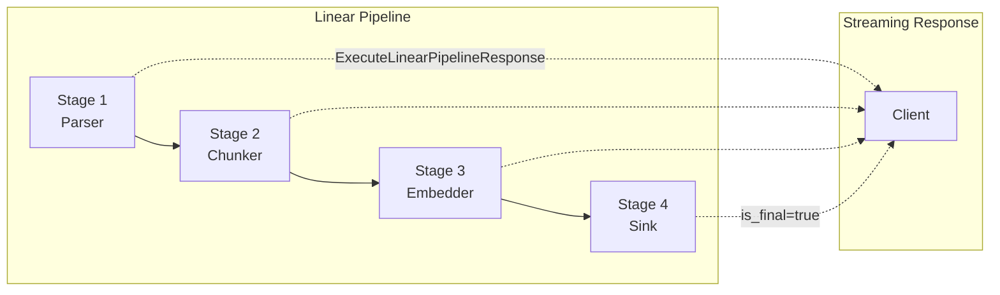
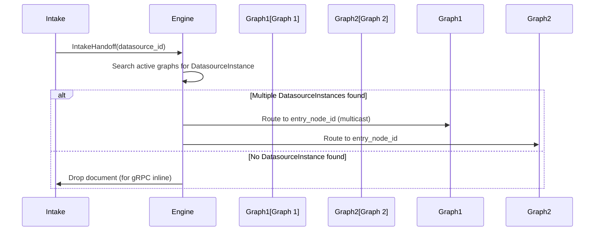

# Engine

> Part of the [AI Pipestream](https://github.com/ai-pipestream) platform - Open-source document processing for intelligent search

## Overview

The **engine** module defines the pipeline orchestration and routing engine—the core coordinator of the Pipestream platform. It implements DNS-like routing for document processing, manages Kafka topic subscriptions for load balancing, and provides cross-cluster routing capabilities.

The engine routes documents through processing modules based on pipeline graph configuration, tracking execution history and providing flow control for high-throughput document processing.

## Published Location

**Repository**: [`buf.build/pipestreamai/engine`](https://buf.build/pipestreamai/engine)

## Contents

| Proto File | Purpose |
|------------|---------|
| `ai/pipestream/engine/v1/engine_service.proto` | Core engine service with routing and streaming |
| `ai/pipestream/engine/linear/v1/linear_pipeline_config.proto` | Linear pipeline configuration and execution |

## Architecture



## Dependencies

- `buf.build/grpc/grpc` - gRPC core types
- `buf.build/googleapis/googleapis` - Google common types
- `buf.build/pipestreamai/common` - Core `PipeDoc`, `PipeStream` types
- `buf.build/pipestreamai/pipeline-module` - Module service interface

## Usage

### With Buf CLI

```yaml
# Add to your buf.yaml
deps:
  - buf.build/pipestreamai/engine
```

### Code Generation

```bash
buf generate buf.build/pipestreamai/engine
```

### With Gradle (Java/Kotlin)

```kotlin
dependencies {
    implementation("build.buf.gen:pipestreamai_engine_grpc_java:+")
    implementation("build.buf.gen:pipestreamai_engine_protobuf_java:+")
}
```

## Key Messages

| Message/Service | Description |
|-----------------|-------------|
| `EngineV1Service` | Core engine with routing, streaming, and health |
| `ProcessNodeRequest/Response` | Route document to specific node |
| `ProcessStreamRequest/Response` | Bidirectional streaming for high throughput |
| `IntakeHandoffRequest/Response` | Intake-to-engine document handoff for datasource routing |
| `GetDatasourceInstanceRequest/Response` | Lookup DatasourceInstance configuration (Tier 2) |
| `DatasourceInstance` | Graph-level datasource configuration (Tier 2) |
| `NodeConfig` | Per-node configuration with output hints and overrides |
| `RouteToClusterRequest/Response` | Cross-cluster document routing |
| `ProcessingMetrics` | Timing, cache hits, hop count |
| `UpdateTopicSubscriptionsRequest` | Dynamic Kafka subscription management |
| `LinearPipelineConfig` | Sequential pipeline stage definition |

## Subscription Strategies

| Strategy | Description |
|----------|-------------|
| `ALL_TOPICS` | All engines listen to all topics (demo mode) |
| `BALANCED` | Distribute topics evenly across engines |
| `CAPACITY_BASED` | Assign based on engine resources |
| `TOPIC_AFFINITY` | Keep related topics on same engine |

## Linear Pipeline Model



## Intake Handoff & Datasource Routing

The engine provides `IntakeHandoff` RPC for connector-intake-service to route documents into pipelines:



**Key Principles**:
- **Intake is graph-agnostic**: Only knows `datasource_id`, doesn't need cluster/graph knowledge
- **Engine multicasts**: Routes to ALL DatasourceInstances matching the `datasource_id` (one datasource can feed multiple graphs)
- **Tier 2 Configuration**: `DatasourceInstance` contains per-node config (output hints, overrides) - graph-versioned
- **IngestionConfig**: Engine receives resolved config via `StreamMetadata.ingestion_config` from intake

## DatasourceInstance (Tier 2 Configuration)

`DatasourceInstance` represents how a datasource is used within a specific pipeline graph:

- **Graph-versioned**: Each graph version has its own `DatasourceInstance`
- **Contains Tier 2 config only**: Per-node overrides and output hints
- **References Tier 1**: References `datasource_id` from datasource-admin (doesn't duplicate Tier 1 config)
- **Entry node binding**: Maps `datasource_id` → `entry_node_id` for routing

See the [2-tier configuration architecture](../intake/README.md#2-tier-configuration-architecture) for details.

## Health Monitoring

The engine exposes health status including:
- Active stream count
- Cache hit rate
- Connected clusters
- Uptime
- Kafka subscription status

## Configuration Dependencies

This module depends on shared types from `common` and `intake`:
- `HydrationConfig` (from `common`) - Used in `NodeConfig.hydration_config`
- `OutputHints` (from `common`) - Used in `NodeConfig.output_hints`
- `PersistenceConfig`, `RetentionConfig` (from `intake`) - Used in `NodeConfig` overrides

## Related Modules

- [`common`](../common/) - Core `PipeStream`, `PipeDoc`, `IngestionConfig`, `HydrationConfig`, `OutputHints`
- [`intake`](../intake/) - Tier 1 configuration types (`PersistenceConfig`, `RetentionConfig`, `EncryptionConfig`)
- [`pipeline-module`](../pipeline-module/) - Module interface the engine invokes
- [`config`](../config/) - Pipeline graph configuration
- [`linear-processor`](../linear-processor/) - Alternative linear execution model

## Related Repositories

- [`pipestream-engine`](https://github.com/ai-pipestream/pipestream-engine) - Engine implementation

## Documentation

- [Buf Schema Registry](https://buf.build/pipestreamai/engine)
- [AI Pipestream Documentation](https://github.com/ai-pipestream)

## License

MIT License - See [LICENSE](./LICENSE) file for details.
