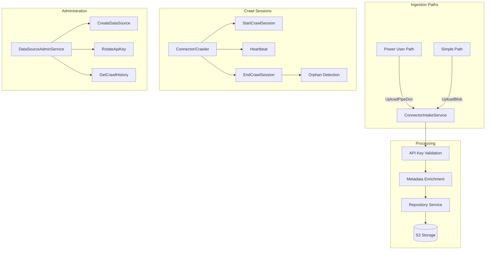
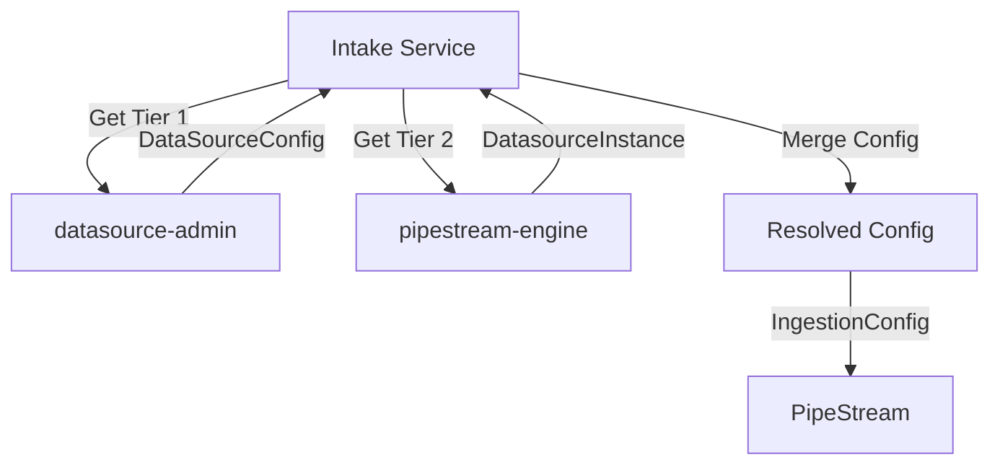
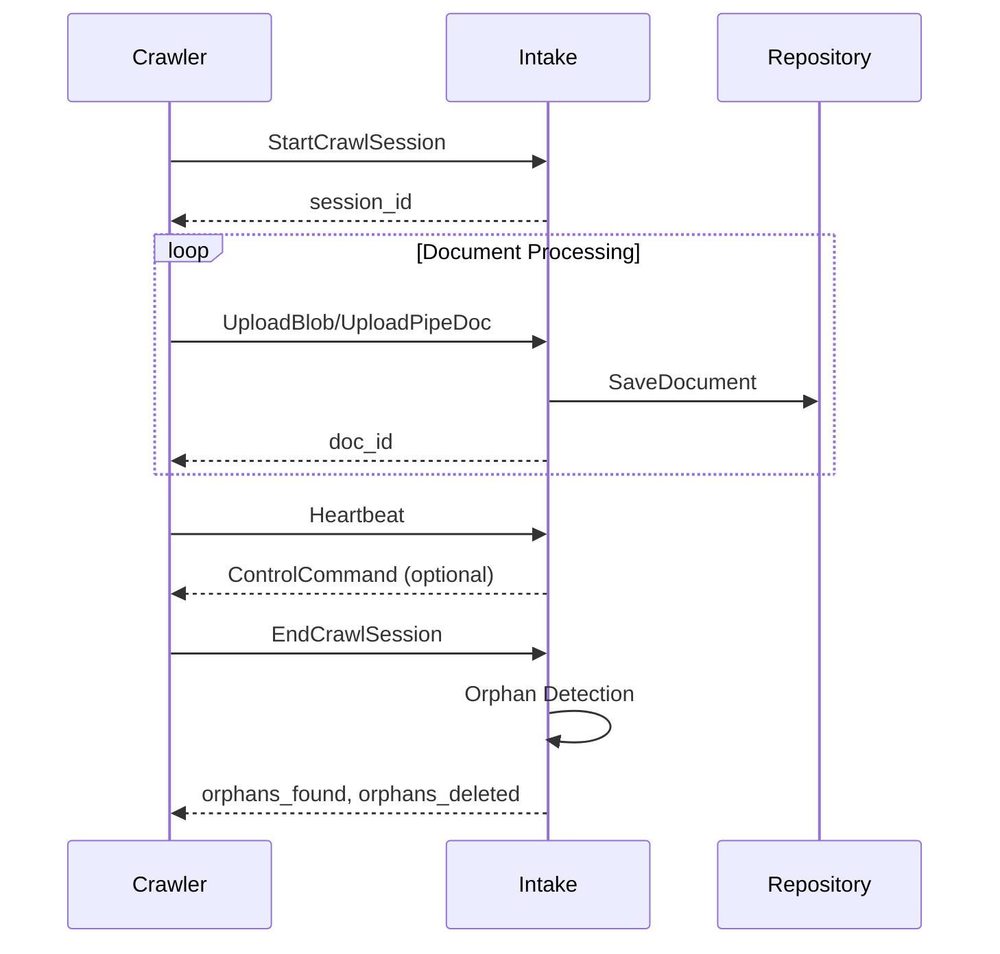

# Intake

> Part of the [AI Pipestream](https://github.com/ai-pipestream) platform - Open-source document processing for intelligent search

## Overview

The **intake** module defines the high-throughput document ingestion entry point for the Pipestream platform. It handles authentication, account validation, metadata enrichment, and routing to the repository layer. The service supports both full `PipeDoc` uploads (power user path) and simple blob uploads (simple path) where the service constructs the wrapper.

This is the first touchpoint for documents entering the pipeline, whether from filesystem crawlers, API integrations, or direct uploads.

## Published Location

**Repository**: [`buf.build/pipestreamai/intake`](https://buf.build/pipestreamai/intake)

## Contents

| Proto File | Purpose |
|------------|---------|
| `ai/pipestream/connector/intake/v1/connector_intake_service.proto` | Intake and admin services for document ingestion |
| `ai/pipestream/connector/intake/v1/document_upload.proto` | Upload message definitions |

## Architecture



## Dependencies

- `buf.build/grpc/grpc` - gRPC core types
- `buf.build/googleapis/googleapis` - Google common types
- `buf.build/pipestreamai/common` - Core `PipeDoc` and `Blob` types

## Usage

### With Buf CLI

```yaml
# Add to your buf.yaml
deps:
  - buf.build/pipestreamai/intake
```

### Code Generation

```bash
buf generate buf.build/pipestreamai/intake
```

### With Gradle (Java/Kotlin)

```kotlin
dependencies {
    implementation("build.buf.gen:pipestreamai_intake_grpc_java:+")
    implementation("build.buf.gen:pipestreamai_intake_protobuf_java:+")
}
```

## Key Messages

| Message/Service | Description |
|-----------------|-------------|
| `ConnectorIntakeService` | Document ingestion: `UploadPipeDoc`, `UploadBlob`, crawl sessions |
| `DataSourceAdminService` | DataSource lifecycle: creation, API keys, status |
| `UploadPipeDocRequest` | Full document upload with datasource auth |
| `UploadBlobRequest` | Simple file upload with auto-wrapping |
| `DataSource` | DataSource metadata, API key, drive config |
| `Connector` | Connector type template (pre-seeded) |
| `DataSourceConfig` | Runtime config with Tier 1 (global) configuration |
| `ConnectorGlobalConfig` | Tier 1 config: persistence, retention, encryption, hydration, custom |
| `PersistenceConfig` | Document persistence rules (`persist_pipedoc`, size limits) |
| `RetentionConfig` | Document retention policies (time-based, version-based) |
| `EncryptionConfig` | Encryption settings (SSE-S3, SSE-KMS, client-provided keys) |
| `CrawlMetadata` / `CrawlSummary` | Crawl session tracking |
| `ControlCommand` | Server-to-crawler commands (PAUSE, STOP, THROTTLE) |

## 2-Tier Configuration Architecture

The intake service uses a **2-tier configuration model** for datasource configuration:

### Tier 1: Global/Default Configuration (Service-Level)
- **Owned by**: `datasource-admin` service
- **Location**: `DataSourceConfig.global_config`
- **Contains**:
  - **Strongly typed fields**: `PersistenceConfig`, `RetentionConfig`, `EncryptionConfig`
  - **Shared types**: `HydrationConfig` (from `common` module)
  - **Custom config**: Connector-specific JSON Schema-validated configuration
- **Merged from**: Connector defaults + DataSource instance overrides
- **Purpose**: Service-level defaults that apply to all uses of a datasource

### Tier 2: Per-Node/Instance Configuration (Graph-Level)
- **Owned by**: `pipestream-engine` service
- **Location**: `DatasourceInstance.node_config` (in engine service)
- **Contains**:
  - Optional overrides of Tier 1 config fields
  - `OutputHints` (shared type from `common` module) - collection hints, routing hints
  - Node-specific custom config
- **Purpose**: Graph-specific overrides and routing hints for how a datasource is used in a specific pipeline

### Configuration Resolution Flow



The intake service merges Tier 1 + Tier 2 configurations to build `IngestionConfig` (from `common` module), which is passed to the engine via `StreamMetadata.ingestion_config`.

## Upload Paths

| Path | Use Case | Request Type |
|------|----------|--------------|
| **Power User** | Internal services, advanced connectors | `UploadPipeDoc` with full `PipeDoc` |
| **Simple** | "I just have a file" scenarios | `UploadBlob` with raw bytes + metadata |

## Crawl Session Lifecycle



## Configuration Dependencies

This module depends on shared types from `common`:
- `HydrationConfig` - Used in `ConnectorGlobalConfig.hydration_config`

See [`common`](../common/) module for shared configuration types.

## Related Modules

- [`common`](../common/) - Core `PipeDoc`, `Blob`, `HydrationConfig`, and `IngestionConfig` types
- [`repo`](../repo/) - Repository service for document storage
- [`engine`](../engine/) - Pipeline orchestration, `DatasourceInstance` (Tier 2 config)

## Related Repositories

- [`pipestream-intake`](https://github.com/ai-pipestream/pipestream-intake) - Intake service implementation
- [`pipestream-connectors`](https://github.com/ai-pipestream/pipestream-connectors) - Connector implementations

## Documentation

- [Buf Schema Registry](https://buf.build/pipestreamai/intake)
- [AI Pipestream Documentation](https://github.com/ai-pipestream)

## License

MIT License - See [LICENSE](./LICENSE) file for details.
