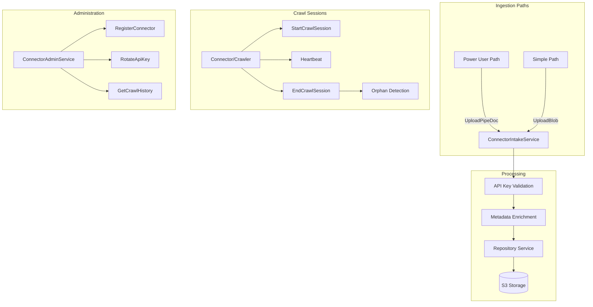
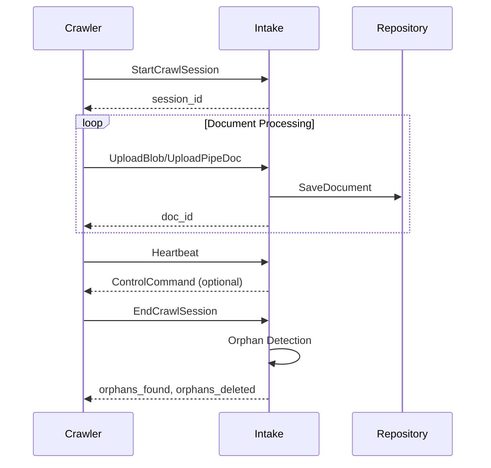

# Intake

> Part of the [AI Pipestream](https://github.com/ai-pipestream) platform - Open-source document processing for intelligent search

## Overview

The **intake** module defines the high-throughput document ingestion entry point for the Pipestream platform. It handles authentication, account validation, metadata enrichment, and routing to the repository layer. The service supports both full `PipeDoc` uploads (power user path) and simple blob uploads (simple path) where the service constructs the wrapper.

This is the first touchpoint for documents entering the pipeline, whether from filesystem crawlers, API integrations, or direct uploads.

## Published Location

**Repository**: [`buf.build/pipestreamai/intake`](https://buf.build/pipestreamai/intake)

## Contents

| Proto File | Purpose |
|------------|---------|
| `ai/pipestream/connector/intake/v1/connector_intake_service.proto` | Intake and admin services for document ingestion |
| `ai/pipestream/connector/intake/v1/document_upload.proto` | Upload message definitions |

## Architecture



## Dependencies

- `buf.build/grpc/grpc` - gRPC core types
- `buf.build/googleapis/googleapis` - Google common types
- `buf.build/pipestreamai/common` - Core `PipeDoc` and `Blob` types

## Usage

### With Buf CLI

```yaml
# Add to your buf.yaml
deps:
  - buf.build/pipestreamai/intake
```

### Code Generation

```bash
buf generate buf.build/pipestreamai/intake
```

### With Gradle (Java/Kotlin)

```kotlin
dependencies {
    implementation("build.buf.gen:pipestreamai_intake_grpc_java:+")
    implementation("build.buf.gen:pipestreamai_intake_protobuf_java:+")
}
```

## Key Messages

| Message/Service | Description |
|-----------------|-------------|
| `ConnectorIntakeService` | Document ingestion: `UploadPipeDoc`, `UploadBlob`, crawl sessions |
| `ConnectorAdminService` | Connector lifecycle: registration, API keys, status |
| `UploadPipeDocRequest` | Full document upload with connector auth |
| `UploadBlobRequest` | Simple file upload with auto-wrapping |
| `ConnectorRegistration` | Connector metadata, API key, S3 config |
| `CrawlMetadata` / `CrawlSummary` | Crawl session tracking |
| `ControlCommand` | Server-to-crawler commands (PAUSE, STOP, THROTTLE) |

## Upload Paths

| Path | Use Case | Request Type |
|------|----------|--------------|
| **Power User** | Internal services, advanced connectors | `UploadPipeDoc` with full `PipeDoc` |
| **Simple** | "I just have a file" scenarios | `UploadBlob` with raw bytes + metadata |

## Crawl Session Lifecycle



## Related Modules

- [`common`](../common/) - Core `PipeDoc` and `Blob` types
- [`repo`](../repo/) - Repository service for document storage
- [`engine`](../engine/) - Pipeline orchestration after ingestion

## Related Repositories

- [`pipestream-intake`](https://github.com/ai-pipestream/pipestream-intake) - Intake service implementation
- [`pipestream-connectors`](https://github.com/ai-pipestream/pipestream-connectors) - Connector implementations

## Documentation

- [Buf Schema Registry](https://buf.build/pipestreamai/intake)
- [AI Pipestream Documentation](https://github.com/ai-pipestream)

## License

MIT License - See [LICENSE](./LICENSE) file for details.
