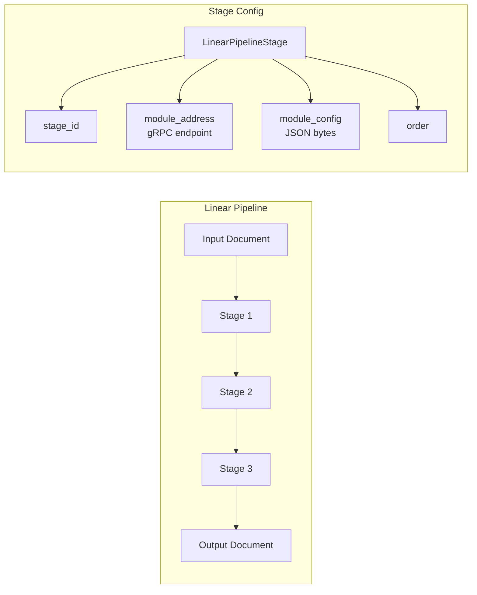
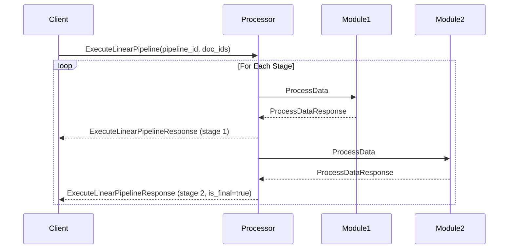
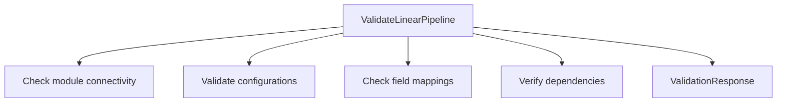

# Linear Processor

> Part of the [AI Pipestream](https://github.com/ai-pipestream) platform - Open-source document processing for intelligent search

## Overview

The **linear-processor** module provides a simplified sequential pipeline execution model for development and testing. Unlike the graph-based engine, it processes documents through ordered stages without complex routing, making it ideal for quick testing, development workflows, and scenarios where simple linear processing is sufficient.

> **Note**: This module represents an earlier processing model. For production workloads with complex routing requirements, consider using the graph-based [`engine`](../engine/) module.

## Published Location

**Repository**: [`buf.build/pipestreamai/linear-processor`](https://buf.build/pipestreamai/linear-processor)

## Contents

| Proto File | Purpose |
|------------|---------|
| `ai/pipestream/linear/processor/v1/linear_pipeline_processor.proto` | Linear pipeline execution service |

## Architecture



## Dependencies

- `buf.build/grpc/grpc` - gRPC core types
- `buf.build/googleapis/googleapis` - Google common types
- `buf.build/pipestreamai/common` - Core `PipeDoc` types
- `buf.build/pipestreamai/pipeline-module` - Module service interface

## Usage

### With Buf CLI

```yaml
# Add to your buf.yaml
deps:
  - buf.build/pipestreamai/linear-processor
```

### Code Generation

```bash
buf generate buf.build/pipestreamai/linear-processor
```

### With Gradle (Java/Kotlin)

```kotlin
dependencies {
    implementation("build.buf.gen:pipestreamai_linear-processor_grpc_java:+")
    implementation("build.buf.gen:pipestreamai_linear-processor_protobuf_java:+")
}
```

## Key Messages

| Message/Service | Description |
|-----------------|-------------|
| `LinearPipelineProcessorService` | Pipeline execution with streaming responses |
| `ExecuteLinearPipelineRequest/Response` | Execute pipeline on documents with stage-by-stage streaming |
| `BatchProcessLinearDocumentsRequest/Response` | Bidirectional streaming for batch processing |
| `ProcessLinearDocumentRequest/Response` | Quick single-document, single-module testing |
| `ValidateLinearPipelineRequest/Response` | Validate pipeline configuration |
| `LinearPipeline` | Pipeline definition with ordered stages |
| `LinearPipelineStage` | Single stage with module address and config |
| `LinearProcessingResult` | Per-stage output with status and timing |

## Execution Modes

| Mode | RPC | Use Case |
|------|-----|----------|
| **Execute Pipeline** | `ExecuteLinearPipeline` | Run full pipeline with streaming progress |
| **Batch Process** | `BatchProcessLinearDocuments` | Process multiple documents in parallel |
| **Quick Test** | `ProcessLinearDocument` | Test single document through single module |
| **Validate** | `ValidateLinearPipeline` | Check configuration without execution |

## Streaming Execution



## Validation

The validation RPC checks:
- Module connectivity (gRPC reachability)
- Configuration validity
- Field mapping correctness
- Missing dependencies



## Related Modules

- [`common`](../common/) - Core `PipeDoc` types
- [`pipeline-module`](../pipeline-module/) - Module interface invoked by stages
- [`engine`](../engine/) - Graph-based pipeline orchestration (production)
- [`testing-harness`](../testing-harness/) - Module testing infrastructure

## Documentation

- [Buf Schema Registry](https://buf.build/pipestreamai/linear-processor)
- [AI Pipestream Documentation](https://github.com/ai-pipestream)

## License

MIT License - See [LICENSE](./LICENSE) file for details.
