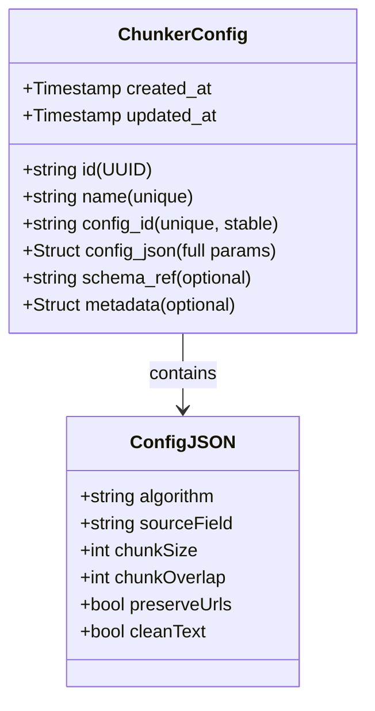
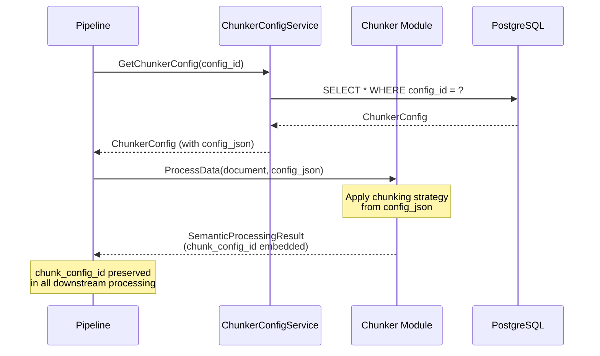

# ChunkerConfigService

gRPC service for managing text chunking strategy configurations.

## Overview

ChunkerConfigService provides CRUD operations for chunker configurations used in document processing pipelines. Chunker configs define how documents are split into chunks before embedding, including algorithm type, chunk size, overlap, and text preprocessing options.

## Service Definition

```protobuf
service ChunkerConfigService {
  rpc CreateChunkerConfig(CreateChunkerConfigRequest) returns (CreateChunkerConfigResponse);
  rpc GetChunkerConfig(GetChunkerConfigRequest) returns (GetChunkerConfigResponse);
  rpc UpdateChunkerConfig(UpdateChunkerConfigRequest) returns (UpdateChunkerConfigResponse);
  rpc DeleteChunkerConfig(DeleteChunkerConfigRequest) returns (DeleteChunkerConfigResponse);
  rpc ListChunkerConfigs(ListChunkerConfigsRequest) returns (ListChunkerConfigsResponse);
}
```

## Data Model

### ChunkerConfig

Stores a chunking strategy configuration with full parameters as JSON.



### config_id Format

Stable identifier derived from chunker parameters:

```
{algorithm}-{sourceField}-{chunkSize}-{chunkOverlap}
```

**Examples:**
- `token-body-512-50` - Token-based chunking, 512 tokens, 50 token overlap
- `sentence-title-1000-100` - Sentence-based chunking, 1000 chars, 100 char overlap
- `character-body-500-0` - Character-based chunking, 500 chars, no overlap

### config_json Structure

Full ChunkerConfig parameters stored as JSON:

```json
{
  "algorithm": "token",
  "sourceField": "body",
  "chunkSize": 512,
  "chunkOverlap": 50,
  "preserveUrls": true,
  "cleanText": true
}
```

**Supported algorithms:**
- `token` - Token-based chunking (default, recommended)
- `character` - Character-based chunking
- `sentence` - Sentence-based chunking
- `semantic` - Semantic boundary chunking (future)

## Usage Examples

### Create a Chunker Config

```bash
grpcurl -plaintext -d '{
  "name": "Standard 512-token chunks",
  "config_id": "token-body-512-50",
  "config_json": {
    "algorithm": "token",
    "sourceField": "body",
    "chunkSize": 512,
    "chunkOverlap": 50,
    "preserveUrls": true,
    "cleanText": true
  }
}' localhost:38103 ai.pipestream.opensearch.v1.ChunkerConfigService/CreateChunkerConfig
```

### Get a Chunker Config

```bash
# By ID
grpcurl -plaintext -d '{
  "id": "550e8400-e29b-41d4-a716-446655440000"
}' localhost:38103 ai.pipestream.opensearch.v1.ChunkerConfigService/GetChunkerConfig

# By name
grpcurl -plaintext -d '{
  "id": "Standard 512-token chunks",
  "by_name": true
}' localhost:38103 ai.pipestream.opensearch.v1.ChunkerConfigService/GetChunkerConfig
```

### List All Chunker Configs

```bash
grpcurl -plaintext -d '{
  "page_size": 50
}' localhost:38103 ai.pipestream.opensearch.v1.ChunkerConfigService/ListChunkerConfigs
```

### Update a Chunker Config

```bash
grpcurl -plaintext -d '{
  "id": "550e8400-e29b-41d4-a716-446655440000",
  "name": "Updated config name",
  "config_json": {
    "algorithm": "token",
    "sourceField": "body",
    "chunkSize": 768,
    "chunkOverlap": 100,
    "preserveUrls": true,
    "cleanText": true
  }
}' localhost:38103 ai.pipestream.opensearch.v1.ChunkerConfigService/UpdateChunkerConfig
```

### Delete a Chunker Config

```bash
grpcurl -plaintext -d '{
  "id": "550e8400-e29b-41d4-a716-446655440000"
}' localhost:38103 ai.pipestream.opensearch.v1.ChunkerConfigService/DeleteChunkerConfig
```

## Integration with Pipeline

### Document Processing Flow



### Audit Trail

Every `SemanticProcessingResult` contains `chunk_config_id`:

```protobuf
message SemanticProcessingResult {
  string result_id = 1;
  string source_field_name = 2;
  string chunk_config_id = 3;  // ← References ChunkerConfig
  string embedding_config_id = 4;
  string result_set_name = 5;
  repeated SemanticChunk chunks = 6;
}
```

This enables traceability: given a vector in OpenSearch, you can trace back to the exact chunking strategy used.

## Schema Validation

### Apicurio Registry Integration

1. **Register ChunkerConfig schema in Apicurio:**
   ```bash
   # Upload schema to Apicurio
   curl -X POST http://apicurio:8080/apis/registry/v2/groups/chunker-configs/artifacts \
     -H "Content-Type: application/json" \
     -d @chunker-config-schema.json
   ```

2. **Store schema reference in ChunkerConfig:**
   ```json
   {
     "schema_ref": "chunker-configs/ChunkerConfig:1.0.0"
   }
   ```

3. **Validate config_json before persistence:**
   - Fetch schema from Apicurio using `schema_ref`
   - Validate `config_json` against schema
   - Reject invalid configurations

## Database Schema

```sql
CREATE TABLE chunker_config (
    id UUID PRIMARY KEY DEFAULT gen_random_uuid(),
    name VARCHAR(255) NOT NULL UNIQUE,
    config_id VARCHAR(255) NOT NULL UNIQUE,
    config_json JSONB NOT NULL,
    schema_ref VARCHAR(255),
    created_at TIMESTAMP WITH TIME ZONE NOT NULL DEFAULT NOW(),
    updated_at TIMESTAMP WITH TIME ZONE NOT NULL DEFAULT NOW(),
    metadata JSONB
);

CREATE INDEX idx_chunker_config_config_id ON chunker_config(config_id);
CREATE INDEX idx_chunker_config_name ON chunker_config(name);
CREATE INDEX idx_chunker_config_created_at ON chunker_config(created_at DESC);
```

## Error Handling

### Common Errors

| Error | Cause | Solution |
|-------|-------|----------|
| `ALREADY_EXISTS` | Duplicate name or config_id | Use unique name/config_id |
| `NOT_FOUND` | Config ID doesn't exist | Verify ID or use by_name lookup |
| `INVALID_ARGUMENT` | Invalid config_json structure | Validate against schema |
| `FAILED_PRECONDITION` | Config referenced by VectorSet | Remove VectorSet references first |

### Example Error Response

```json
{
  "code": "ALREADY_EXISTS",
  "message": "Chunker config with name 'Standard 512-token chunks' already exists",
  "details": {
    "existing_id": "550e8400-e29b-41d4-a716-446655440000"
  }
}
```

## Best Practices

### Naming Conventions

- **name**: Human-readable, descriptive
  - ✅ "Standard 512-token chunks with 50-token overlap"
  - ✅ "Large context 2048-token chunks"
  - ❌ "config1", "test"

- **config_id**: Stable, derived from parameters
  - ✅ "token-body-512-50"
  - ✅ "sentence-title-1000-100"
  - ❌ "my-config", "v1"

### Configuration Management

1. **Pre-register common configs** - Create standard configs during service initialization
2. **Use config_id for lookups** - More stable than name
3. **Version configs** - Include version info in metadata for tracking changes
4. **Test before production** - Validate configs with sample documents before deployment

### Metadata Usage

Store additional context in the `metadata` field:

```json
{
  "creator": "admin@example.com",
  "purpose": "Standard document chunking for RAG",
  "environment": "production",
  "version": "1.0",
  "tested_with": ["pdf", "docx", "txt"],
  "performance_notes": "Optimal for documents < 100 pages"
}
```

## Related Services

- **EmbeddingConfigService** - Manages embedding model configurations
- **VectorSetService** (planned) - Combines ChunkerConfig + EmbeddingConfig
- **Chunker Module** - Consumes ChunkerConfig to perform actual chunking

## References

- [ChunkerConfig Proto Definition](proto/ai/pipestream/opensearch/v1/chunker_config.proto)
- [OpenSearch Module README](README.md)
- [Chunker Module Documentation](../../../modules/module-chunker/README.md)
