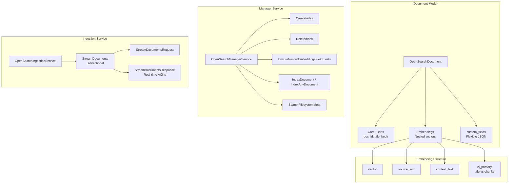
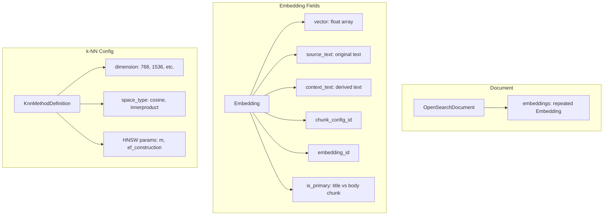
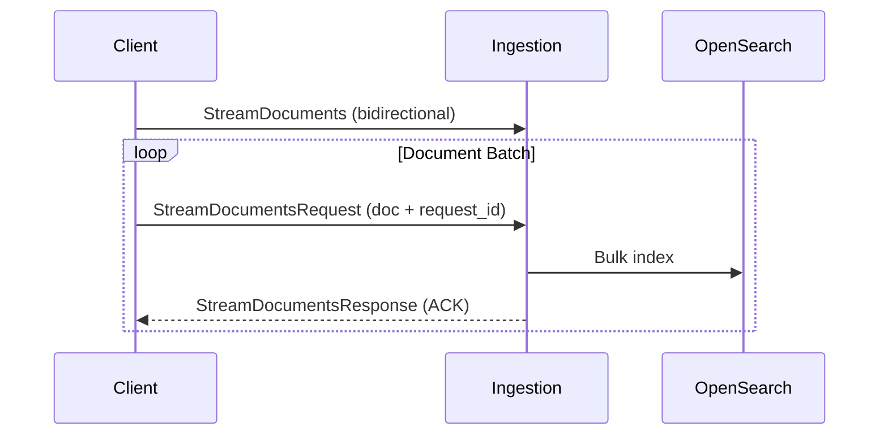

# OpenSearch

> Part of the [AI Pipestream](https://github.com/ai-pipestream) platform - Open-source document processing for intelligent search

## Overview

The **opensearch** module provides OpenSearch indexing, collection management, and semantic search capabilities. It defines the document structure for OpenSearch indices, the manager service for schema and index lifecycle operations, and a high-throughput ingestion service for streaming document indexing.

This is the sink layer of the platform—where processed documents with embeddings are indexed for semantic and keyword search.

## Published Location

**Repository**: [`buf.build/pipestreamai/opensearch`](https://buf.build/pipestreamai/opensearch)

## Contents

| Proto File | Purpose |
|------------|---------|
| `ai/pipestream/opensearch/v1/opensearch_document.proto` | Canonical OpenSearch document structure |
| `ai/pipestream/opensearch/v1/opensearch_manager.proto` | Index management, schema, and document operations |
| `ai/pipestream/ingestion/v1/opensearch_ingestion.proto` | High-throughput streaming ingestion |

## Architecture



## Dependencies

- `buf.build/grpc/grpc` - gRPC core types
- `buf.build/googleapis/googleapis` - Google common types
- `buf.build/pipestreamai/common` - Core `PipeDoc` types

## Usage

### With Buf CLI

```yaml
# Add to your buf.yaml
deps:
  - buf.build/pipestreamai/opensearch
```

### Code Generation

```bash
buf generate buf.build/pipestreamai/opensearch
```

### With Gradle (Java/Kotlin)

```kotlin
dependencies {
    implementation("build.buf.gen:pipestreamai_opensearch_grpc_java:+")
    implementation("build.buf.gen:pipestreamai_opensearch_protobuf_java:+")
}
```

## Key Messages

| Message/Service | Description |
|-----------------|-------------|
| `OpenSearchManagerService` | Schema management, index lifecycle, document CRUD |
| `OpenSearchIngestionService` | Bidirectional streaming for high-throughput indexing |
| `OpenSearchDocument` | Canonical document with embeddings and custom fields |
| `Embedding` | Vector with source text, context, and metadata |
| `VectorFieldDefinition` | k-NN configuration (dimension, engine, space type) |
| `KnnMethodDefinition` | HNSW parameters (m, ef_construction, ef_search) |
| `SearchFilesystemMetaRequest/Response` | Filesystem metadata search |

## Embedding Model



## Streaming Ingestion



## Related Modules

- [`common`](../common/) - Core `PipeDoc` with semantic chunks
- [`admin`](../admin/) - Schema manager integration
- [`engine`](../engine/) - Routes documents to OpenSearch sink

## Related Repositories

- [`pipestream-opensearch`](https://github.com/ai-pipestream/pipestream-opensearch) - OpenSearch service implementation

## Documentation

- [Buf Schema Registry](https://buf.build/pipestreamai/opensearch)
- [AI Pipestream Documentation](https://github.com/ai-pipestream)

## License

MIT License - See [LICENSE](./LICENSE) file for details.
