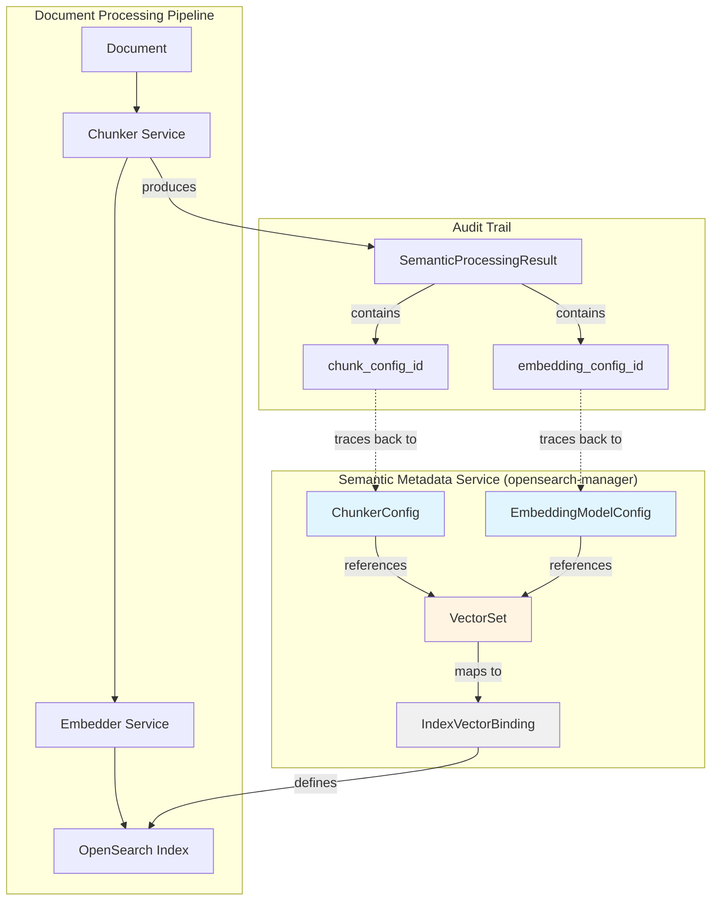
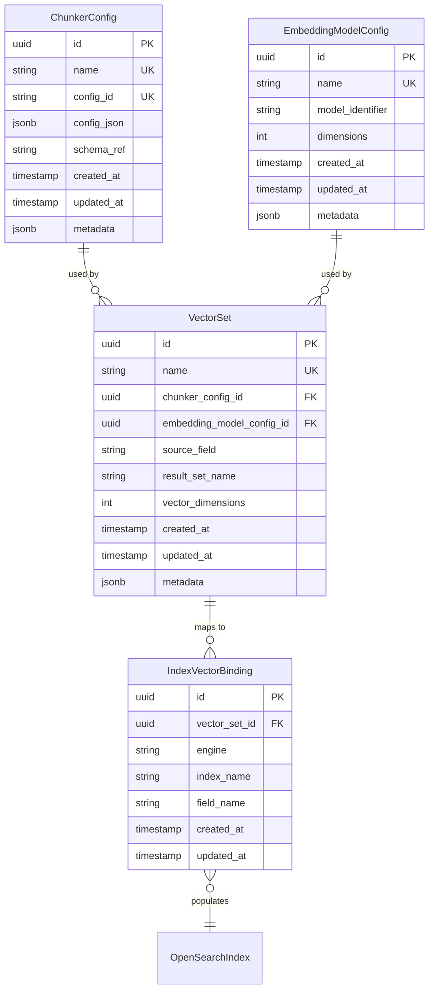
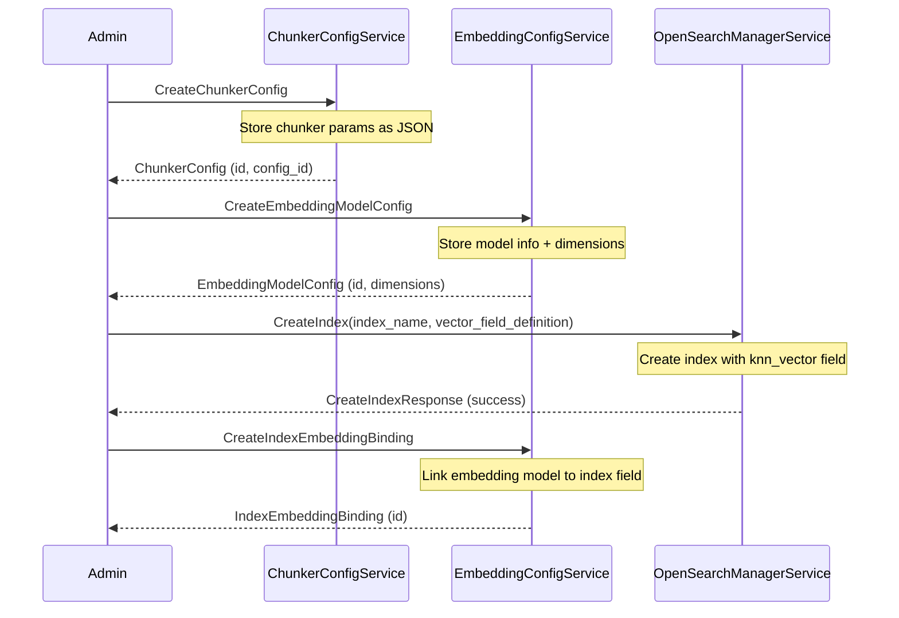
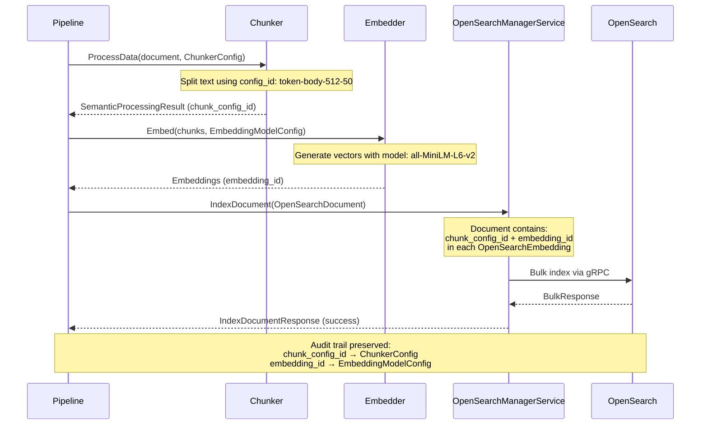

# OpenSearch Proto Module

This module defines the protocol buffer schemas for OpenSearch indexing, search, and semantic metadata management.

## Overview

The OpenSearch module provides gRPC services and message types for:

1. **Document Indexing** - Canonical document structure for OpenSearch with vector embeddings
2. **Embedding Configuration** - CRUD for embedding model configs and index-field bindings
3. **Chunker Configuration** - CRUD for text chunking strategies and parameters
4. **OpenSearch Management** - Index lifecycle, schema management, and search operations

## Services

### OpenSearchManagerService

Manages OpenSearch indices, documents, and search operations.

**Key RPCs:**
- `CreateIndex` - Create index with vector field mappings
- `IndexDocument` - Index a canonical OpenSearchDocument
- `IndexAnyDocument` - Index arbitrary protobuf messages with dynamic mapping
- `SearchFilesystemMeta` - Search documents with highlighting and pagination

### EmbeddingConfigService

Manages embedding model configurations and index-to-embedding bindings.

**Key RPCs:**
- `CreateEmbeddingModelConfig` - Register an embedding model (name, identifier, dimensions)
- `CreateIndexEmbeddingBinding` - Bind an embedding model to an index field
- CRUD operations for both configs and bindings

### ChunkerConfigService

Manages chunker configurations for text splitting strategies.

**Key RPCs:**
- `CreateChunkerConfig` - Register a chunking strategy (algorithm, size, overlap)
- CRUD operations with JSON blob storage for flexibility

## Data Model

### Semantic Metadata Architecture



### Entity Relationships



## Message Types

### OpenSearchDocument

Canonical structure for documents indexed in OpenSearch.

**Key Fields:**
- `original_doc_id` - Source document identifier
- `title`, `body`, `tags` - Core content fields
- `embeddings` - Nested array of `OpenSearchEmbedding` objects
- `custom_fields` - Flexible JSON container for user-defined data

### OpenSearchEmbedding

Represents a single vector embedding with metadata.

**Key Fields:**
- `vector` - Float array of embedding values
- `source_text` - Original text that was embedded
- `chunk_config_id` - Identifier of chunking strategy used
- `embedding_id` - Identifier of embedding model used
- `is_primary` - Flag for primary (title) vs secondary (chunk) embeddings

### ChunkerConfig

Stores text chunking strategy configurations.

**Key Fields:**
- `config_id` - Stable identifier (e.g., "token-body-512-50")
- `config_json` - Full chunker parameters as JSON blob
- `schema_ref` - Optional Apicurio Registry reference for validation

**Example config_json:**
```json
{
  "algorithm": "token",
  "sourceField": "body",
  "chunkSize": 512,
  "chunkOverlap": 50,
  "preserveUrls": true,
  "cleanText": true
}
```

### EmbeddingModelConfig

Stores embedding model configurations.

**Key Fields:**
- `model_identifier` - Model name/path (e.g., "sentence-transformers/all-MiniLM-L6-v2")
- `dimensions` - Vector dimensionality (e.g., 384)
- `metadata` - Additional model info (version, provider, etc.)

### IndexEmbeddingBinding

Links an embedding model to a specific OpenSearch index field.

**Key Fields:**
- `index_name` - Target OpenSearch index
- `embedding_model_config_id` - FK to EmbeddingModelConfig
- `field_name` - Field path (e.g., "embeddings_384.embedding")
- `result_set_name` - Optional result set identifier from pipeline

## Workflow Examples

### Creating a Vector-Enabled Index



### Document Indexing with Audit Trail



## Configuration

### Index Naming Convention

Indices follow the pattern: `{domain}-{type}-{version}`

Examples:
- `repository-pipedocs` - Repository document index
- `filesystem-drives` - Filesystem drive metadata
- `filesystem-nodes` - Filesystem node metadata

### Field Naming Convention

Vector fields use dimension-based naming: `embeddings_{dimension}`

Examples:
- `embeddings_384` - For 384-dimensional vectors (MiniLM)
- `embeddings_768` - For 768-dimensional vectors (BERT-base)
- `embeddings_1536` - For 1536-dimensional vectors (OpenAI ada-002)

### Result Set Naming

Result sets from chunking follow: `{pipeStepName}_chunks_{config_id}`

Examples:
- `chunker-v1_chunks_token-body-512-50`
- `title-chunker_chunks_sentence-title-1000-100`

## Schema Validation

Chunker configurations can be validated against schemas stored in Apicurio Registry:

1. Register ChunkerConfig schema in Apicurio
2. Store artifact reference in `ChunkerConfig.schema_ref`
3. Validate `config_json` against schema before persistence

## Future Extensions

### VectorSet Entity (Planned)

A composite entity that ties together chunker + embedder + metadata:

```protobuf
message VectorSet {
  string id = 1;
  string name = 2;
  string chunker_config_id = 3;  // FK to ChunkerConfig
  string embedding_model_config_id = 4;  // FK to EmbeddingModelConfig
  string source_field = 5;  // e.g., "body", "title"
  string result_set_name = 6;
  int32 vector_dimensions = 7;  // Denormalized from embedding config
  google.protobuf.Timestamp created_at = 8;
  google.protobuf.Timestamp updated_at = 9;
  google.protobuf.Struct metadata = 10;
}
```

This will enable:
- Single entity representing "how to produce vectors"
- Simplified index binding (bind VectorSet → index field)
- Better audit trail and traceability

## References

- [OpenSearch k-NN Plugin](https://opensearch.org/docs/latest/search-plugins/knn/index/)
- [OpenSearch gRPC Transport](https://github.com/opensearch-project/opensearch-protobufs)
- [Apicurio Registry](https://www.apicur.io/registry/)
