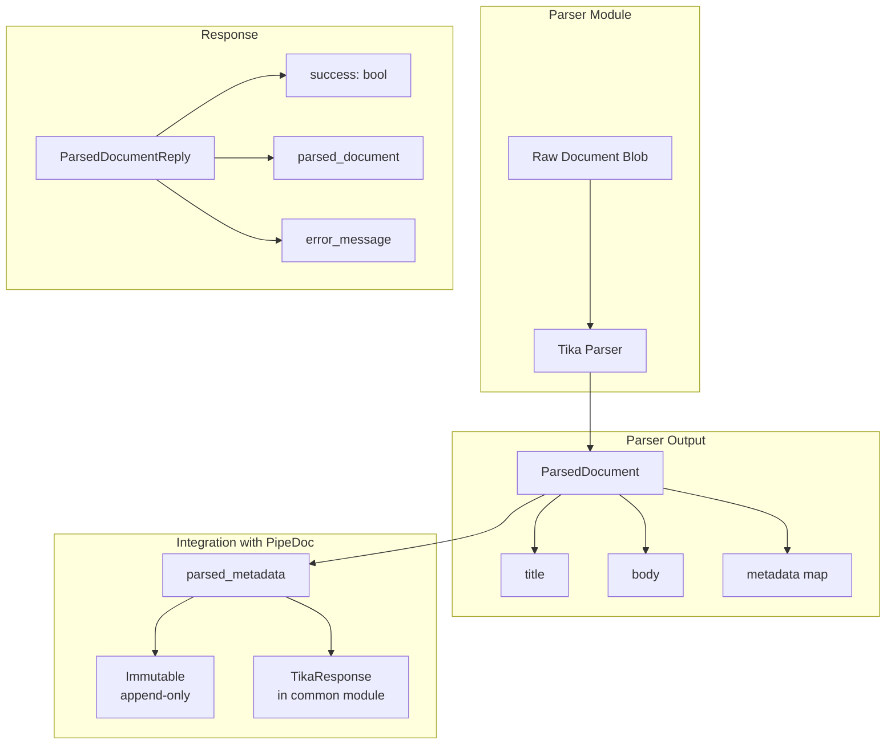
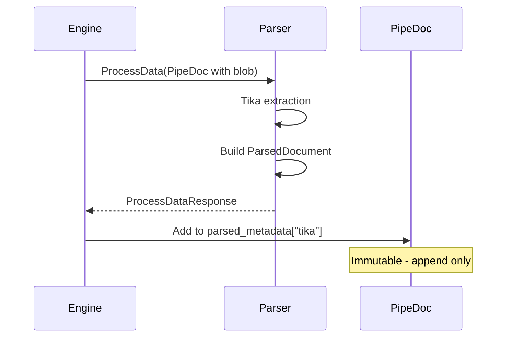

# Parser

> Part of the [AI Pipestream](https://github.com/ai-pipestream) platform - Open-source document processing for intelligent search

## Overview

The **parser** module defines the document parsing service interface, primarily based on Apache Tika. It provides the `ParsedDocument` and `ParsedDocumentReply` messages for text extraction and metadata parsing from various document formats.

Parsers are processing modules that extract text and metadata from raw document blobs, populating the immutable `parsed_metadata` field in `PipeDoc`. The output feeds into downstream enrichment, chunking, and indexing steps.

## Published Location

**Repository**: [`buf.build/pipestreamai/parser`](https://buf.build/pipestreamai/parser)

## Contents

| Proto File | Purpose |
|------------|---------|
| `ai/pipestream/processing/tika/v1/tika_parser.proto` | Tika parser output messages |

## Architecture



## Dependencies

- `buf.build/grpc/grpc` - gRPC core types
- `buf.build/googleapis/googleapis` - Google common types
- `buf.build/pipestreamai/common` - Core types including `TikaResponse`

## Usage

### With Buf CLI

```yaml
# Add to your buf.yaml
deps:
  - buf.build/pipestreamai/parser
```

### Code Generation

```bash
buf generate buf.build/pipestreamai/parser
```

### With Gradle (Java/Kotlin)

```kotlin
dependencies {
    implementation("build.buf.gen:pipestreamai_parser_grpc_java:+")
    implementation("build.buf.gen:pipestreamai_parser_protobuf_java:+")
}
```

## Key Messages

| Message | Description |
|---------|-------------|
| `ParsedDocument` | Extracted title, body text, and metadata map |
| `ParsedDocumentReply` | Parser response with success status and error handling |

## Supported Formats

The Tika-based parser supports a wide variety of document formats:

| Category | Formats |
|----------|---------|
| Documents | PDF, DOCX, DOC, ODT, RTF, TXT |
| Spreadsheets | XLSX, XLS, ODS, CSV |
| Presentations | PPTX, PPT, ODP |
| Email | EML, MSG, MBOX |
| Web | HTML, XHTML |
| eBooks | EPUB, MOBI |
| Images | JPEG, PNG, TIFF (with OCR) |
| Archives | ZIP, TAR, GZIP |
| Media | MP3, MP4 (metadata only) |

## Parser Integration



## Detailed Metadata

For comprehensive parsed metadata structures including format-specific fields (PDF, Office, Image, Email, etc.), see the [`common`](../common/) module which defines the full `TikaResponse` message with specialized metadata types.

## Related Modules

- [`common`](../common/) - Full `TikaResponse` and format-specific metadata
- [`pipeline-module`](../pipeline-module/) - Module service interface
- [`repo`](../repo/) - Document storage with blobs
- [`engine`](../engine/) - Pipeline orchestration

## Related Repositories

- [`pipestream-parser`](https://github.com/ai-pipestream/pipestream-parser) - Parser module implementation
- [Apache Tika](https://tika.apache.org/) - Upstream parsing library

## Documentation

- [Buf Schema Registry](https://buf.build/pipestreamai/parser)
- [Apache Tika Documentation](https://tika.apache.org/documentation.html)
- [AI Pipestream Documentation](https://github.com/ai-pipestream)

## License

MIT License - See [LICENSE](./LICENSE) file for details.
