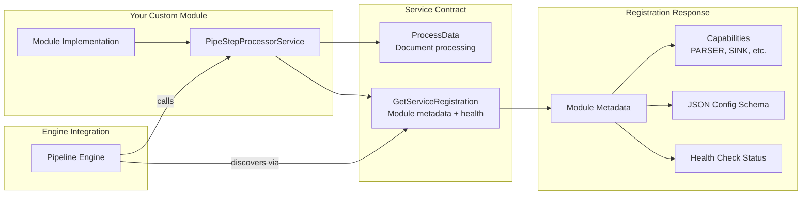

# Pipeline Module

> Part of the [AI Pipestream](https://github.com/ai-pipestream) platform - Open-source document processing for intelligent search

## Overview

The **pipeline-module** defines the standard gRPC interface that all document processing modules must implement. It provides the `PipeStepProcessorService` contract—the universal API for creating custom processing steps that can be plugged into any Pipestream pipeline.

When building custom modules (parsers, enrichers, chunkers, embedders, sinks), you implement this interface. The engine then discovers and orchestrates your module through this standardized contract.

## Published Location

**Repository**: [`buf.build/pipestreamai/pipeline-module`](https://buf.build/pipestreamai/pipeline-module)

## Contents

| Proto File | Purpose |
|------------|---------|
| `ai/pipestream/data/module/v1/module_service.proto` | `PipeStepProcessorService` interface and related messages |

## Architecture



## Dependencies

- `buf.build/grpc/grpc` - gRPC core types
- `buf.build/googleapis/googleapis` - Google common types
- `buf.build/pipestreamai/common` - Core `PipeDoc` and data types

## Usage

### With Buf CLI

```yaml
# Add to your buf.yaml
deps:
  - buf.build/pipestreamai/pipeline-module
```

### Code Generation

```bash
buf generate buf.build/pipestreamai/pipeline-module
```

### With Gradle (Java/Kotlin)

```kotlin
dependencies {
    implementation("build.buf.gen:pipestreamai_pipeline-module_grpc_java:+")
    implementation("build.buf.gen:pipestreamai_pipeline-module_protobuf_java:+")
}
```

## Key Messages

| Message/Service | Description |
|-----------------|-------------|
| `PipeStepProcessorService` | gRPC service interface for all processing modules |
| `ProcessDataRequest` | Input document, configuration, and pipeline metadata |
| `ProcessDataResponse` | Output document, success status, and processing logs |
| `GetServiceRegistrationResponse` | Module identity, capabilities, JSON schema, health status |
| `Capabilities` | Module capability types (PARSER, SINK, etc.) |
| `ServiceMetadata` | Engine-provided context: pipeline name, stream ID, hop number |
| `ProcessConfiguration` | Step-specific JSON config and parameters |

## Implementing a Module

```java
// Example: Implement the PipeStepProcessorService
public class MyChunkerModule extends PipeStepProcessorServiceGrpc.PipeStepProcessorServiceImplBase {

    @Override
    public void processData(ProcessDataRequest request, StreamObserver<ProcessDataResponse> response) {
        PipeDoc inputDoc = request.getDocument();
        // Your processing logic here
        response.onNext(ProcessDataResponse.newBuilder()
            .setSuccess(true)
            .setOutputDoc(transformedDoc)
            .build());
        response.onCompleted();
    }

    @Override
    public void getServiceRegistration(GetServiceRegistrationRequest request,
                                        StreamObserver<GetServiceRegistrationResponse> response) {
        response.onNext(GetServiceRegistrationResponse.newBuilder()
            .setModuleName("my-chunker")
            .setVersion("1.0.0")
            .setDisplayName("My Chunker Module")
            .setHealthCheckPassed(true)
            .build());
        response.onCompleted();
    }
}
```

## Related Modules

- [`common`](../common/) - Core `PipeDoc` types used in requests/responses
- [`registration`](../registration/) - Platform service discovery
- [`testing-harness`](../testing-harness/) - Module integration testing
- [`linear-processor`](../linear-processor/) - Sequential pipeline execution

## Related Repositories

- [`pipestream-module-sdk`](https://github.com/ai-pipestream/pipestream-module-sdk) - SDK for building modules

## Documentation

- [Buf Schema Registry](https://buf.build/pipestreamai/pipeline-module)
- [AI Pipestream Documentation](https://github.com/ai-pipestream)

## License

MIT License - See [LICENSE](./LICENSE) file for details.
