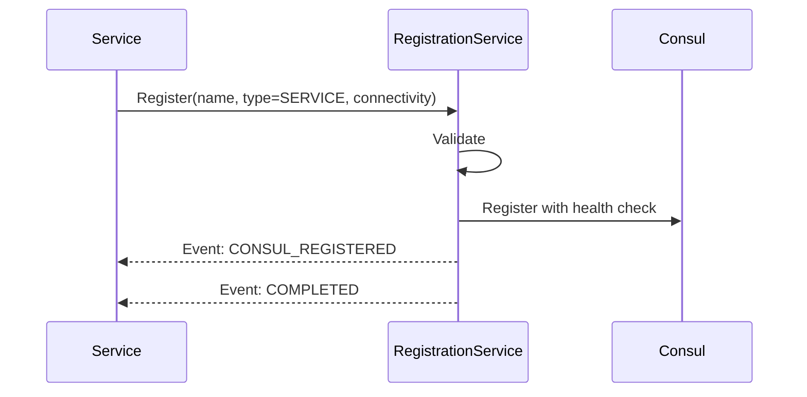
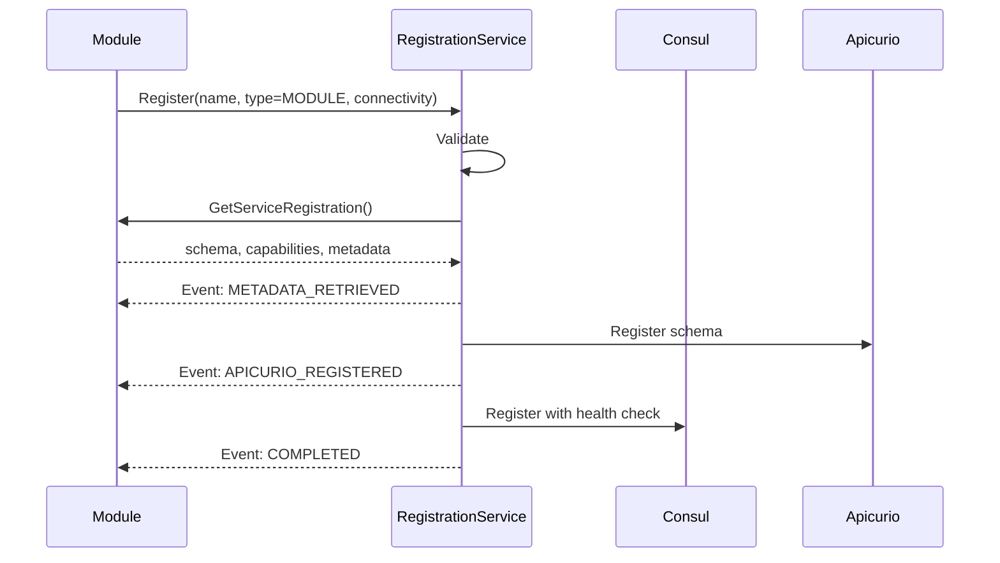
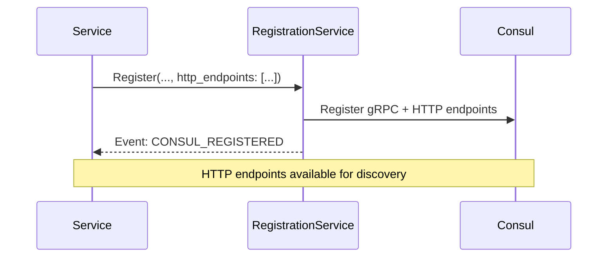
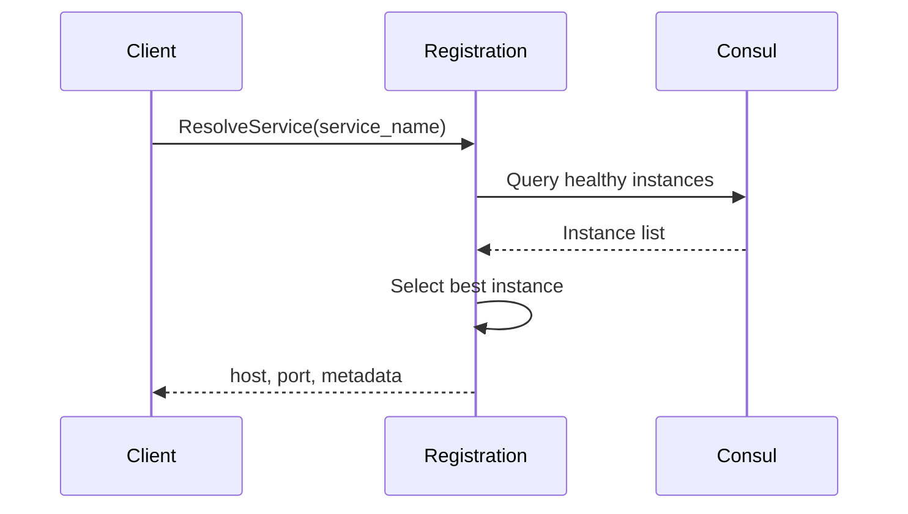

# Registration

> Part of the [AI Pipestream](https://github.com/ai-pipestream) platform - Open-source document processing for intelligent search

## Overview

The **registration** module provides unified service discovery and registration for all platform services and processing modules. It integrates with Consul for service discovery, Apicurio Registry for schema management, and provides real-time streaming updates for service health and availability.

All services in the Pipestream platform register through this module, enabling dynamic discovery, health monitoring, and schema validation for processing modules.

**Design Philosophy**: This module is intentionally **self-contained** with no dependencies on pipeline processing types (PipeDoc, Blob, etc.). Services register with minimal metadata, and the platform-registration-service fetches module-specific metadata via callback.

## Published Location

**Repository**: [`buf.build/pipestreamai/registration`](https://buf.build/pipestreamai/registration)

## Contents

| Proto File | Purpose |
|------------|---------|
| `ai/pipestream/platform/registration/v1/platform_registration.proto` | Unified registration service, events, and schema management |

## Architecture

```mermaid
graph TD
    subgraph "Registration Flow"
        SVC[Service/Module]
        SVC -->|Register<br/>(unified RPC)| PRS[PlatformRegistrationService]
    end

    subgraph "Module Callback (if type=MODULE)"
        PRS -->|GetServiceRegistration| MOD[Module]
        MOD -->|schema, capabilities| PRS
    end

    subgraph "Streaming Events"
        PRS --> EV[RegistrationEvent stream]
        EV --> STARTED[STARTED]
        EV --> VALIDATED[VALIDATED]
        EV --> CONSUL_REG[CONSUL_REGISTERED]
        EV --> HEALTH[HEALTH_CHECK_CONFIGURED]
        EV --> METADATA[METADATA_RETRIEVED]
        EV --> SCHEMA[SCHEMA_VALIDATED]
        EV --> APICURIO[APICURIO_REGISTERED]
        EV --> COMPLETED[COMPLETED]
    end

    subgraph "Discovery"
        PRS --> RESOLVE[ResolveService]
        PRS --> LIST[ListServices / ListModules]
        PRS --> WATCH[WatchServices / WatchModules]
    end

    subgraph "Backends"
        PRS --> CONSUL[(Consul)]
        PRS --> APIC[(Apicurio Registry)]
        PRS --> DB[(Database)]
    end

    subgraph "Published Events"
        KAFKA[Kafka Events]
        CONSUL_REG --> KAFKA
        KAFKA --> SRVR[ServiceRegistered]
        KAFKA --> MODR[ModuleRegistered]
    end
```

## Dependencies

- `buf.build/grpc/grpc` - gRPC core types
- `buf.build/googleapis/googleapis` - Google common types (Timestamp)

**Note**: This module has **NO dependencies** on other Pipestream modules. It is intentionally isolated to prevent API bleeding.

## Usage

### With Buf CLI

```yaml
# Add to your buf.yaml
deps:
  - buf.build/pipestreamai/registration
```

### Code Generation

```bash
buf generate buf.build/pipestreamai/registration
```

### With Gradle (Java/Kotlin)

```kotlin
dependencies {
    implementation("build.buf.gen:pipestreamai_registration_grpc_java:+")
    implementation("build.buf.gen:pipestreamai_registration_protobuf_java:+")
}
```

## Key Messages

| Message/Service | Description |
|-----------------|-------------|
| `PlatformRegistrationService` | Unified registration, discovery, and schema management |
| `RegisterRequest/RegisterResponse` | Unified registration for services and modules with streaming events |
| `UnregisterRequest/UnregisterResponse` | Unified unregistration for services and modules |
| `ServiceType` | Enum: `SERVICE` or `MODULE` |
| `Connectivity` | gRPC connection info (advertised/internal host/port, TLS) |
| `HttpEndpoint` | HTTP endpoint definition (scheme/host/port/base_path/health_path/TLS) |
| `RegistrationEvent` | Streaming lifecycle events during registration |
| `ResolveServiceRequest/Response` | Find best available service instance with gRPC + HTTP endpoints |
| `GetModuleSchemaRequest/Response` | Retrieve JSON schema from Apicurio |
| `WatchServicesResponse` / `WatchModulesResponse` | Real-time health updates with full endpoint info |

## Registration Flow

### Services


### Modules (with Callback)


## Connectivity Message

The `Connectivity` message separates advertised addresses (what clients connect to) from internal addresses (actual binding):

```protobuf
message Connectivity {
  string advertised_host = 1;  // Client-facing address
  int32 advertised_port = 2;   // Client-facing port
  optional string internal_host = 3;  // Actual bind address
  optional int32 internal_port = 4;   // Actual bind port
  bool tls_enabled = 5;        // TLS/SSL enabled
}
```

This supports NAT, Docker, Kubernetes where services bind to `0.0.0.0:8080` but advertise as `my-service.example.com:443`.

## HTTP Endpoint Registration

Services can register both gRPC and HTTP endpoints for dual-protocol service discovery. The `HttpEndpoint` message defines HTTP-specific connection information:

```protobuf
message HttpEndpoint {
  string scheme = 1;       // "http" or "https"
  string host = 2;          // Client-facing hostname
  int32 port = 3;           // Client-facing port
  string base_path = 4;     // API base path (e.g., "/api/v1")
  string health_path = 5;   // Health check endpoint (e.g., "/health")
  bool tls_enabled = 6;     // Whether TLS/SSL is enabled
}
```

### HTTP Endpoint Registration Flow



### HTTP Endpoint Discovery

HTTP endpoints are included in all discovery responses:

- `ResolveServiceResponse.http_endpoints` - HTTP endpoints for the selected instance
- `GetServiceResponse.http_endpoints` - HTTP endpoints for the requested service
- `WatchServicesResponse.services[].http_endpoints` - HTTP endpoints in streaming updates

Services can also register OpenAPI/REST schemas for HTTP API documentation and validation.

## Registration Event Types

| Event | Description | Applies To |
|-------|-------------|------------|
| `STARTED` | Registration process initiated | All |
| `VALIDATED` | Input validated successfully | All |
| `CONSUL_REGISTERED` | Registered with Consul | All |
| `HEALTH_CHECK_CONFIGURED` | Health check set up | All |
| `METADATA_RETRIEVED` | Module metadata fetched via callback | Modules only |
| `SCHEMA_VALIDATED` | Module schema validated | Modules only |
| `APICURIO_REGISTERED` | Schema stored in Apicurio Registry | Modules only |
| `DATABASE_SAVED` | Registration persisted to database | All |
| `COMPLETED` | Registration complete | All |
| `FAILED` | Registration failed at any stage | All |

## Service Resolution

The `ResolveService` RPC finds the best available instance based on:
- Health status
- Load balancing
- Locality preference (`prefer_local`)
- Required tags and capabilities



## Design Decisions

### Why No Dependencies on Common/Pipeline-Module?

Previously, this module imported from `pipeline-module`, which transitively pulled in `common` (containing PipeDoc, Blob, etc.). This caused **API bleeding** - services that only wanted to register themselves ended up with 100+ document processing types on their classpath.

**Solution**:
- Registration proto is **self-contained** (only depends on google.protobuf types)
- Platform-registration-service **calls back** to modules via `GetServiceRegistration` RPC
- Modules own their metadata; registration service fetches it on-demand
- Clean separation: registration lane vs processing lane

### Why Merge RegisterService + RegisterModule?

Both RPCs did the same thing with slightly different metadata. The `ServiceType` enum achieves the same discrimination with cleaner API:

**Before (4 RPCs)**:
- `RegisterService(RegisterServiceRequest)`
- `RegisterModule(RegisterModuleRequest)`
- `UnregisterService(UnregisterServiceRequest)`
- `UnregisterModule(UnregisterModuleRequest)`

**After (2 RPCs)**:
- `Register(RegisterRequest)` - with `type: SERVICE | MODULE`
- `Unregister(UnregisterRequest)` - handles both

Simpler client code, same functionality.

## Related Services

- **platform-registration-service** - Implements this proto, manages Consul/Apicurio
- **pipestream-service-registration-extension** - Quarkus extension for easy registration

## Documentation

- [Buf Schema Registry](https://buf.build/pipestreamai/registration)
- [AI Pipestream Documentation](https://github.com/ai-pipestream)

## License

MIT License - See [LICENSE](./LICENSE) file for details.
