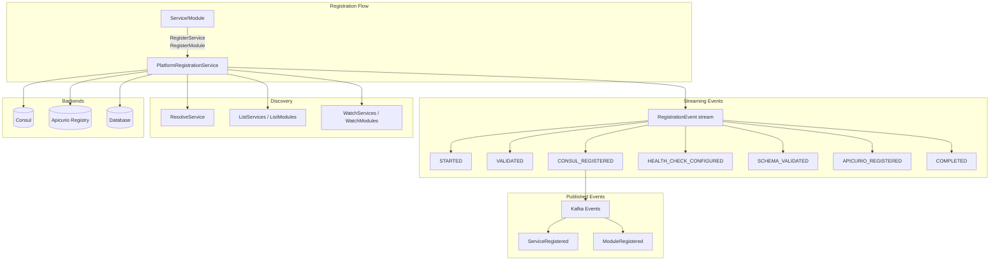
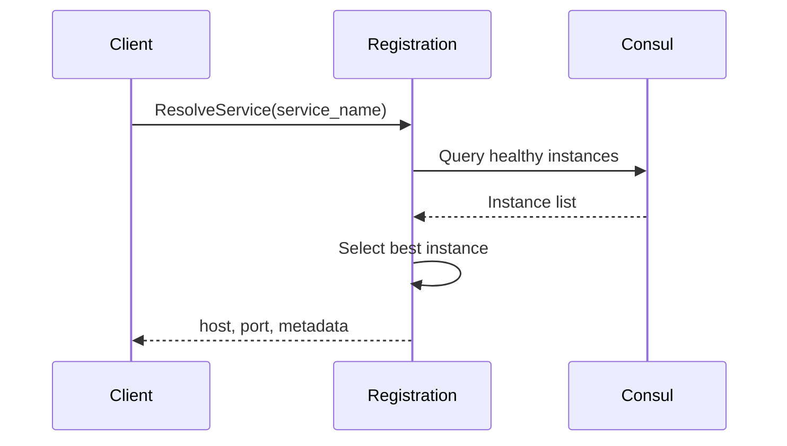

# Registration

> Part of the [AI Pipestream](https://github.com/ai-pipestream) platform - Open-source document processing for intelligent search

## Overview

The **registration** module provides unified service discovery and registration for all platform services and processing modules. It integrates with Consul for service discovery, Apicurio Registry for schema management, and provides real-time streaming updates for service health and availability.

All services in the Pipestream platform register through this module, enabling dynamic discovery, health monitoring, and schema validation for processing modules.

## Published Location

**Repository**: [`buf.build/pipestreamai/registration`](https://buf.build/pipestreamai/registration)

## Contents

| Proto File | Purpose |
|------------|---------|
| `ai/pipestream/platform/registration/v1/platform_registration.proto` | Unified registration service, events, and schema management |

## Architecture



## Dependencies

- `buf.build/grpc/grpc` - gRPC core types
- `buf.build/googleapis/googleapis` - Google common types
- `buf.build/pipestreamai/common` - Core data types
- `buf.build/pipestreamai/pipeline-module` - Module metadata types

## Usage

### With Buf CLI

```yaml
# Add to your buf.yaml
deps:
  - buf.build/pipestreamai/registration
```

### Code Generation

```bash
buf generate buf.build/pipestreamai/registration
```

### With Gradle (Java/Kotlin)

```kotlin
dependencies {
    implementation("build.buf.gen:pipestreamai_registration_grpc_java:+")
    implementation("build.buf.gen:pipestreamai_registration_protobuf_java:+")
}
```

## Key Messages

| Message/Service | Description |
|-----------------|-------------|
| `PlatformRegistrationService` | Unified registration, discovery, and schema management |
| `RegisterServiceRequest/Response` | Service registration with streaming events |
| `RegisterModuleRequest/Response` | Module registration with schema validation |
| `RegistrationEvent` | Streaming lifecycle events during registration |
| `ResolveServiceRequest/Response` | Find best available service instance |
| `GetModuleSchemaRequest/Response` | Retrieve JSON schema from Apicurio |
| `WatchServicesResponse` / `WatchModulesResponse` | Real-time health updates |

## Registration Event Types

| Event | Description |
|-------|-------------|
| `STARTED` | Registration process initiated |
| `VALIDATED` | Input validated successfully |
| `CONSUL_REGISTERED` | Registered with Consul |
| `HEALTH_CHECK_CONFIGURED` | Health check set up |
| `SCHEMA_VALIDATED` | Module schema validated |
| `APICURIO_REGISTERED` | Schema stored in Apicurio Registry |
| `COMPLETED` | Registration complete |
| `FAILED` | Registration failed at any stage |

## Service Resolution

The `ResolveService` RPC finds the best available instance based on:
- Health status
- Load balancing
- Locality preference (`prefer_local`)
- Required tags and capabilities



## Related Modules

- [`common`](../common/) - Core data types
- [`pipeline-module`](../pipeline-module/) - Module metadata used in registration
- [`config`](../config/) - Configuration service using registration

## Documentation

- [Buf Schema Registry](https://buf.build/pipestreamai/registration)
- [AI Pipestream Documentation](https://github.com/ai-pipestream)

## License

MIT License - See [LICENSE](./LICENSE) file for details.
