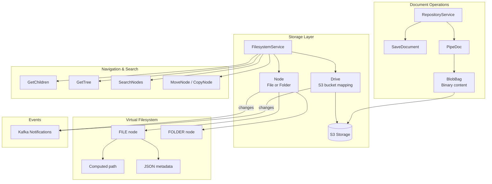
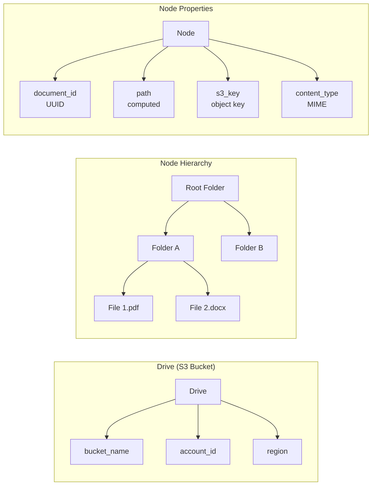

# Repo

> Part of the [AI Pipestream](https://github.com/ai-pipestream) platform - Open-source document processing for intelligent search

## Overview

The **repo** module provides document repository services for persistent storage, retrieval, and filesystem management. It implements a virtual filesystem abstraction over S3 storage, enabling multi-tenant document organization through drives and nodes (files/folders).

This module is the persistence backbone of the platform—all ingested documents flow through the repository service for storage, and the engine hydrates documents from here during pipeline processing.

## Published Location

**Repository**: [`buf.build/pipestreamai/repo`](https://buf.build/pipestreamai/repo)

## Contents

| Proto File | Purpose |
|------------|---------|
| `ai/pipestream/repository/v1/repository_service.proto` | Core document save/retrieve operations |
| `ai/pipestream/repository/v1/graph_repository_service.proto` | Graph-based repository operations |
| `ai/pipestream/repository/filesystem/v1/filesystem_service.proto` | Virtual filesystem with drives/nodes |
| `ai/pipestream/repository/filesystem/v1/repository_events.proto` | Filesystem change notifications |
| `ai/pipestream/repository/filesystem/upload/v1/upload_service.proto` | File upload handling |
| `ai/pipestream/repository/crawler/v1/filesystem_crawler.proto` | Filesystem crawling for content discovery |
| `ai/pipestream/repository/pipedoc/v1/pipedoc_service.proto` | PipeDoc-specific storage operations |

## Architecture



## Dependencies

- `buf.build/grpc/grpc` - gRPC core types
- `buf.build/googleapis/googleapis` - Google common types
- `buf.build/pipestreamai/common` - Core `PipeDoc` and `Blob` types
- `buf.build/pipestreamai/pipeline-module` - Module service interface
- `buf.build/pipestreamai/config` - Configuration types

## Usage

### With Buf CLI

```yaml
# Add to your buf.yaml
deps:
  - buf.build/pipestreamai/repo
```

### Code Generation

```bash
buf generate buf.build/pipestreamai/repo
```

### With Gradle (Java/Kotlin)

```kotlin
dependencies {
    implementation("build.buf.gen:pipestreamai_repo_grpc_java:+")
    implementation("build.buf.gen:pipestreamai_repo_protobuf_java:+")
}
```

## Key Messages

| Message/Service | Description |
|-----------------|-------------|
| `FilesystemService` | Virtual filesystem operations: drives, nodes, navigation, search |
| `RepositoryService` | Document persistence with S3 backend |
| `Drive` | Multi-tenant S3 bucket mapping with credentials |
| `Node` | File or folder with path, metadata, and optional payload |
| `SaveDocumentRequest/Response` | Store `PipeDoc` with connector tracking |
| `SearchNodesRequest` | OpenSearch-powered search with facets and highlighting |
| `TreeNode` | Recursive tree structure for navigation |

## Drive & Node Model



## Related Modules

- [`common`](../common/) - Core `PipeDoc` and `Blob` types
- [`config`](../config/) - Configuration for repository settings
- [`intake`](../intake/) - Document ingestion that stores to repository
- [`admin`](../admin/) - Account management for multi-tenancy

## Related Repositories

- [`pipestream-repository`](https://github.com/ai-pipestream/pipestream-repository) - Repository service implementation

## Documentation

- [Buf Schema Registry](https://buf.build/pipestreamai/repo)
- [AI Pipestream Documentation](https://github.com/ai-pipestream)

## License

MIT License - See [LICENSE](./LICENSE) file for details.
