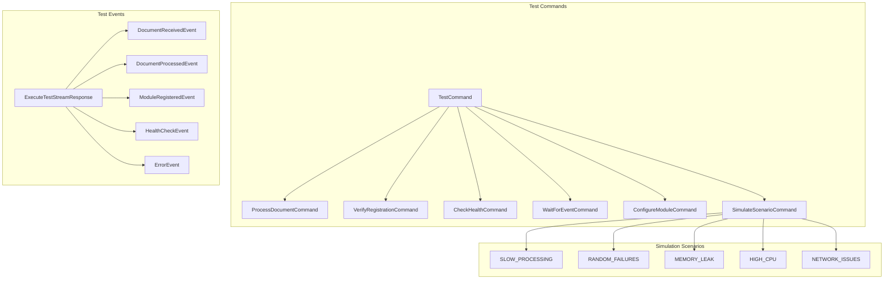
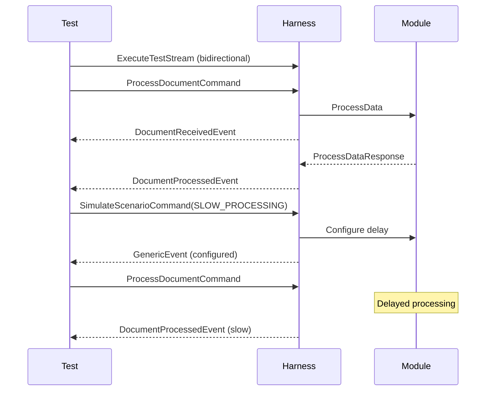

# Testing Harness

> Part of the [AI Pipestream](https://github.com/ai-pipestream) platform - Open-source document processing for intelligent search

## Overview

The **testing-harness** module provides comprehensive integration testing infrastructure for pipeline modules. It supports bidirectional streaming for interactive testing, scenario simulation (slow processing, random failures, resource issues), and real-time event monitoring during test execution.

This module enables developers to validate module behavior, test resilience, and simulate edge cases before deploying modules to production pipelines.

## Published Location

**Repository**: [`buf.build/pipestreamai/testing-harness`](https://buf.build/pipestreamai/testing-harness)

## Contents

| Proto File | Purpose |
|------------|---------|
| `ai/pipestream/testing/harness/v1/testing_harness.proto` | Test harness service and command/event messages |

## Architecture



## Dependencies

- `buf.build/grpc/grpc` - gRPC core types
- `buf.build/googleapis/googleapis` - Google common types
- `buf.build/pipestreamai/common` - Core `PipeDoc` types
- `buf.build/pipestreamai/pipeline-module` - Module service interface

## Usage

### With Buf CLI

```yaml
# Add to your buf.yaml
deps:
  - buf.build/pipestreamai/testing-harness
```

### Code Generation

```bash
buf generate buf.build/pipestreamai/testing-harness
```

### With Gradle (Java/Kotlin)

```kotlin
dependencies {
    implementation("build.buf.gen:pipestreamai_testing-harness_grpc_java:+")
    implementation("build.buf.gen:pipestreamai_testing-harness_protobuf_java:+")
}
```

## Key Messages

| Message/Service | Description |
|-----------------|-------------|
| `TestHarnessService` | Streaming and unary test execution RPCs |
| `ExecuteTestStream` | Bidirectional streaming for interactive testing |
| `ExecuteTest` | Simple unary RPC for basic test scenarios |
| `TestCommand` | Command wrapper with specific command types |
| `ExecuteTestStreamResponse` | Event stream with test results |
| `GetModuleStatusResponse` | Module operational metrics and state |

## Test Commands

| Command | Purpose |
|---------|---------|
| `ProcessDocumentCommand` | Send document through module |
| `VerifyRegistrationCommand` | Check Consul registration |
| `CheckHealthCommand` | Perform health check |
| `WaitForEventCommand` | Synchronize on specific events |
| `ConfigureModuleCommand` | Dynamically configure module behavior |
| `SimulateScenarioCommand` | Inject failure/stress scenarios |

## Simulation Scenarios

| Scenario | Description |
|----------|-------------|
| `SLOW_PROCESSING` | Artificial processing delays |
| `RANDOM_FAILURES` | Probabilistic processing failures |
| `MEMORY_LEAK` | Gradual memory growth simulation |
| `HIGH_CPU` | CPU stress simulation |
| `NETWORK_ISSUES` | Network connectivity problems |

## Interactive Testing Flow



## Module Status

The `GetModuleStatus` RPC returns:
- Registration status
- Documents processed/failed counts
- Last activity timestamp
- Current configuration
- Active simulation scenarios

## Related Modules

- [`common`](../common/) - Core `PipeDoc` types
- [`pipeline-module`](../pipeline-module/) - Module interface being tested
- [`linear-processor`](../linear-processor/) - Alternative testing via linear execution
- [`registration`](../registration/) - Service discovery being verified

## Documentation

- [Buf Schema Registry](https://buf.build/pipestreamai/testing-harness)
- [AI Pipestream Documentation](https://github.com/ai-pipestream)

## License

MIT License - See [LICENSE](./LICENSE) file for details.
