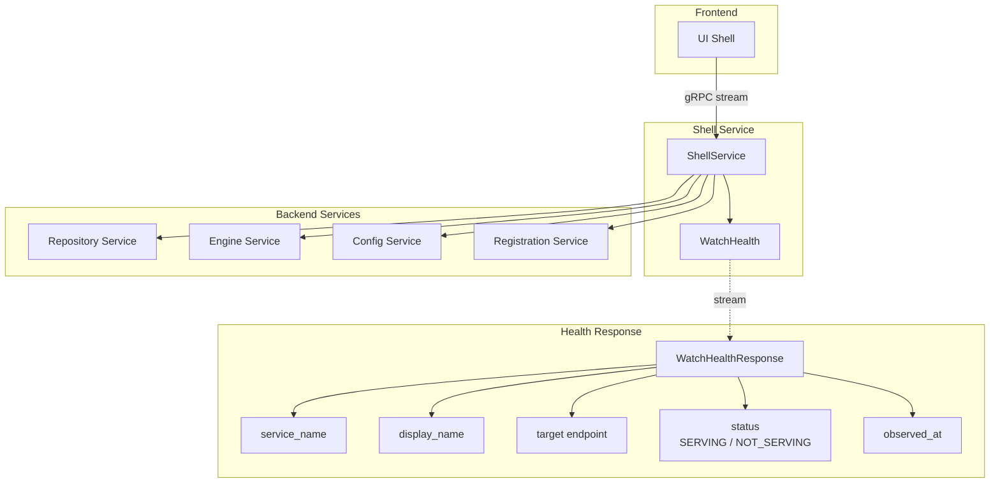
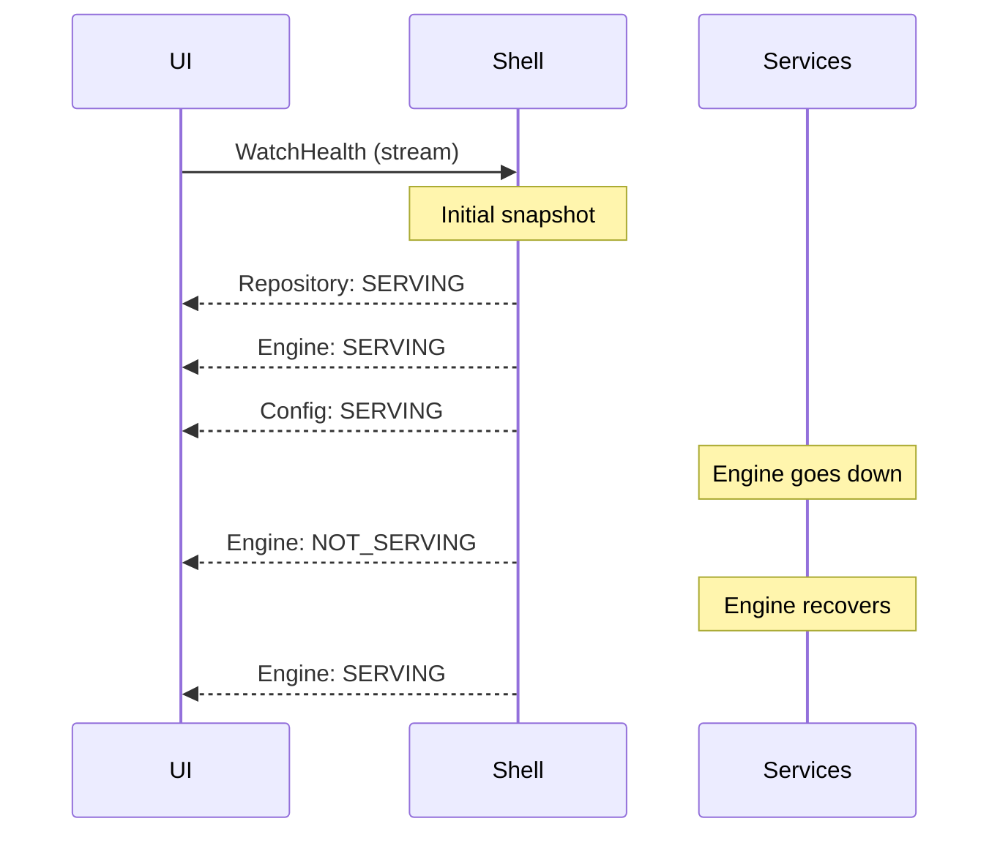

# UI-UX

> Part of the [AI Pipestream](https://github.com/ai-pipestream) platform - Open-source document processing for intelligent search

## Overview

The **ui-ux** module provides the frontend shell service for UI state management and health monitoring. It aggregates health status from core platform services and streams real-time updates to the frontend, enabling the UI to display service availability and system health.

This lightweight module serves as the backend-for-frontend (BFF) layer, providing a unified endpoint for UI state without requiring direct connections to individual services.

## Published Location

**Repository**: [`buf.build/pipestreamai/ui-ux`](https://buf.build/pipestreamai/ui-ux)

## Contents

| Proto File | Purpose |
|------------|---------|
| `ai/pipestream/shell/v1/shell_service.proto` | Shell service for aggregated health streaming |

## Architecture



## Dependencies

- `buf.build/grpc/grpc` - gRPC core types including health check protocol
- `buf.build/googleapis/googleapis` - Google common types

## Usage

### With Buf CLI

```yaml
# Add to your buf.yaml
deps:
  - buf.build/pipestreamai/ui-ux
```

### Code Generation

```bash
buf generate buf.build/pipestreamai/ui-ux
```

### With Gradle (Java/Kotlin)

```kotlin
dependencies {
    implementation("build.buf.gen:pipestreamai_ui-ux_grpc_java:+")
    implementation("build.buf.gen:pipestreamai_ui-ux_protobuf_java:+")
}
```

## Key Messages

| Message/Service | Description |
|-----------------|-------------|
| `ShellService` | Aggregated UI state service |
| `WatchHealthRequest` | Request to start health streaming |
| `WatchHealthResponse` | Per-service health update |

## Health Streaming

The `WatchHealth` RPC provides:
1. **Initial snapshot**: One update per monitored service
2. **Incremental updates**: Pushed when any service health changes



## Health Status Values

| Status | Meaning |
|--------|---------|
| `SERVING` | Service is healthy and accepting requests |
| `NOT_SERVING` | Service is unhealthy or unavailable |
| `UNKNOWN` | Health status cannot be determined |

## Response Fields

| Field | Description |
|-------|-------------|
| `service_name` | Logical service name (e.g., "repository-service") |
| `display_name` | Human-friendly label for UI display |
| `target` | Resolved endpoint or "dynamic" |
| `status` | gRPC health check status |
| `observed_at` | ISO-8601 timestamp of health check |

## Related Modules

- [`registration`](../registration/) - Service discovery underlying health checks
- [`design`](../design/) - Design mode UI backend

## Related Repositories

- [`pipestream-ui`](https://github.com/ai-pipestream/pipestream-ui) - Frontend application consuming this service

## Documentation

- [Buf Schema Registry](https://buf.build/pipestreamai/ui-ux)
- [gRPC Health Checking Protocol](https://github.com/grpc/grpc/blob/master/doc/health-checking.md)
- [AI Pipestream Documentation](https://github.com/ai-pipestream)

## License

MIT License - See [LICENSE](./LICENSE) file for details.
